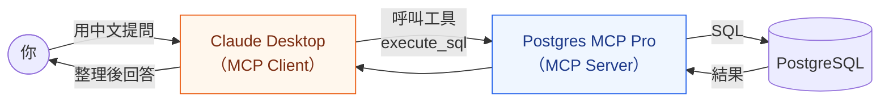
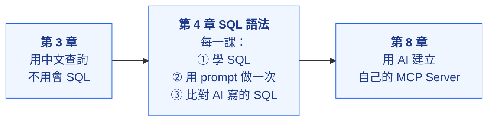

# 第 3 章：安裝 MCP，用中文查詢資料庫

還沒學 SQL 也沒關係。安裝好 MCP 之後，**用中文問問題，AI 就會幫你查詢資料庫**。

> 「最貴的商品是什麼？」「哪些商品缺貨了？」「哪個月的訂單最多？」
> → AI 透過 MCP 查詢 PostgreSQL → 整理成表格回答你

---

## 什麼是 MCP？

**MCP（Model Context Protocol）** 是 AI 連接外部工具與資料的標準規格，就像 USB 是電腦連接各種裝置的標準。

| 名詞 | 白話說明 |
|---|---|
| **MCP Client** | AI 這一端，本課程使用 Claude Desktop |
| **MCP Server** | 提供「工具」給 AI 呼叫的程式，本章使用別人寫好的 Postgres MCP Pro |
| **Tool（工具）** | MCP Server 的一個功能，例如 `list_objects`（列出資料表）、`execute_sql`（執行 SQL） |
| **access mode** | Postgres MCP Pro 的權限：`restricted` 只能查詢、`unrestricted` 可以建表與修改資料 |

---

## 本章單元

| 單元 | 內容 |
|---|---|
| [3-1 安裝與設定 Postgres MCP Pro](./1_postgres_mcp_pro/) | 安裝 Postgres MCP Pro，在 Claude Desktop 設定連到 `practice` 資料庫（唯讀） |
| [3-2 第一次用中文查詢資料庫](./2_用中文查詢資料庫/) ⭐ | 用中文查詢網路商店資料（附答案），並設定第 4 章要用的「可寫入」連線 |

---

## 接下來的課程怎麼使用 MCP

學 SQL 的目的不是取代 AI，而是**看得懂 AI 寫的 SQL**：

| 情況 | 沒學過 SQL | 學過 SQL |
|---|---|---|
| AI 的 `UPDATE` 漏了 `WHERE` | 沒發現，整張表都被改掉 | 一眼看出來，阻止執行 |
| AI 用 `JOIN` 而不是 `LEFT JOIN` | 不知道少了一些資料 | 知道結果不完整 |
| AI 說「已完成」 | 相信它 | 用查詢確認結果 |

---

## 下一步

👉 [第 4 章：SQL 語法](../README.md#4-sql-語法)
