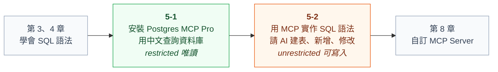

# 第 5 章：用 AI 操作資料庫（MCP）

學完 SQL 語法之後，接下來讓 **AI 幫你下 SQL**：用中文說出需求，AI 透過 MCP 連到 PostgreSQL 執行，你負責檢查 AI 寫的 SQL 對不對。

> 「建立一個學生資料表，email 不可以重複」「分數最高的 3 位學生」「把小華的分數改成 62 分」
> → AI 寫出 SQL → 透過 MCP 在資料庫執行 → 你檢查 SQL 和結果

---

## 什麼是 MCP？

**MCP（Model Context Protocol）** 是 AI 連接外部工具與資料的標準規格，就像 USB 是電腦連接各種裝置的標準。

| 名詞 | 白話說明 |
|---|---|
| **MCP Client** | AI 這一端，本課程使用 Claude Desktop |
| **MCP Server** | 提供「工具」給 AI 呼叫的程式，本章使用別人寫好的 Postgres MCP Pro |
| **Tool（工具）** | MCP Server 的一個功能，例如 `list_objects`（列出資料表）、`execute_sql`（執行 SQL） |
| **access mode** | Postgres MCP Pro 的權限：`restricted` 只能查詢、`unrestricted` 可以建表與修改資料 |

---

## 本章單元

| 單元 | 你的角色 | 內容 |
|---|---|---|
| [5-1 使用現成的 MCP Server](./1_postgres_mcp_pro/) | 使用者 | 安裝 Postgres MCP Pro、設定 Claude Desktop，用中文查詢範例資料庫；也可以連到 Supabase 雲端資料庫 |
| [5-2 用 MCP 實作 SQL 語法](./2_用MCP實作SQL語法/) ⭐ | 下指令、檢查 SQL | 依照 SQL 講義的順序，請 AI 建立資料表、新增、查詢、修改、刪除、JOIN、GROUP BY、子查詢、JSON，並逐一檢查 AI 寫的 SQL |

---

## 為什麼要先學 SQL，再用 AI？

| 情況 | 沒學過 SQL | 學過 SQL |
|---|---|---|
| AI 的 `UPDATE` 漏了 `WHERE` | 沒發現，整張表都被改掉 | 一眼看出來，阻止執行 |
| AI 用 `JOIN` 而不是 `LEFT JOIN` | 不知道少了沒選課的學生 | 知道結果不完整 |
| AI 把分數存成 `VARCHAR` | 以為沒問題 | 知道之後無法正確排序、計算 |
| AI 說「已完成」 | 相信它 | 用 `SELECT` 確認結果 |

**AI 寫 SQL，人負責檢查**，這也是第 8 章「用 AI 建立 MCP Server」的基礎。

---

## 下一步

本章的 Postgres MCP Pro 讓 AI 可以執行**任何 SQL**，適合自己練習或工程師使用，但不適合開放給公司的一般員工。

學完 [第 6 章 Python](../python/) 和 [第 7 章實戰專案](../tutorial_container/) 後，👉 [第 8 章：自訂 MCP Server](../mcp_server/) 會教你用 AI 建立**只開放特定功能、需要 token 才能連線**的 MCP Server，讓企業可以安全地導入。
