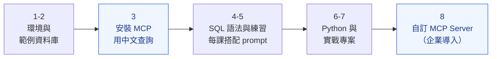

# PostgreSQL 學習指南

從安裝開始就用 AI（MCP）查詢資料庫，再學 SQL 語法、Python 串接、實戰專案，最後自訂 MCP Server 的 PostgreSQL 完整課程。

## 學習路線

| 步驟 | 單元 | 你會學到 |
|:---:|---|---|
| 1 | [環境安裝](#1-環境安裝) | 安裝 PostgreSQL Server 與管理工具 |
| 2 | [範例資料庫](#2-範例資料庫) | 匯入練習用的資料 |
| 3 | [安裝 MCP，用中文查詢資料庫](#3-安裝-mcp用中文查詢資料庫) | 還不會 SQL，就能用中文請 AI 查詢資料庫 |
| 4 | [SQL 語法](#4-sql-語法) | 每一課先學 SQL，再用 prompt 讓 AI 做一次並對照 |
| 5 | [SQL 練習](#5-sql-練習) | 用範例資料庫動手寫查詢 |
| 6 | [Python 串接](#6-python-串接psycopg2) | 用 psycopg2 從 Python 存取資料庫 |
| 7 | [實戰專案](#7-實戰專案) | CLI 與 Streamlit 資料應用 |
| 8 | [自訂 MCP Server](#8-自訂-mcp-server企業導入) | 用 AI 建立 MCP Server，讓企業員工用 Claude Desktop + token 查詢資料庫 |



📖 [參考文件](#參考文件)

---

## 1. 環境安裝

### PostgreSQL Server

| 安裝方式 | 說明 |
|---|---|
| **Docker**（推薦） | 一行指令完成，見下方 |
| Linux / Raspberry Pi | [安裝教學](./server安裝/) |
| 其它作業系統 | [PostgreSQL 官網下載](https://www.postgresql.org/download/) |

```bash
docker run --name my-postgres -e POSTGRES_PASSWORD=yourpassword -p 5432:5432 -d postgres
```

| 參數 | 說明 |
|---|---|
| `--name my-postgres` | 容器名稱 |
| `-e POSTGRES_PASSWORD=yourpassword` | 設定預設帳號 `postgres` 的密碼 |
| `-p 5432:5432` | 將容器的 5432 埠對應到本機 5432 埠 |
| `-d postgres` | 在背景執行，使用官方 postgres 映像檔 |

> [!NOTE]
> 目前只測試過本機連線，從其它電腦連線的設定尚未測試成功。

### 管理工具

| 工具 | 說明 |
|---|---|
| [pgAdmin](https://www.pgadmin.org) | PostgreSQL 官方管理工具 |
| [DBeaver](https://dbeaver.io/) | 通用資料庫管理工具，支援多種資料庫 |

<details>
<summary>DBeaver 連線設定（JDBC）</summary>

```
URL      : jdbc:postgresql://主機網址/資料庫名稱
Username : 使用者名稱
Password : 使用者密碼
```

</details>

---

## 2. 範例資料庫

📁 [範例資料庫總覽](./範例資料庫/)

| 範例 | 大小 | 說明 |
|---|---|---|
| ⭐ [繁體中文範例資料庫](./範例資料庫/中文範例資料庫/) | 50–90 KB | 網路商店、學校選課、圖書館借閱；各一個 `.sql` 檔，執行就能匯入，附 ER 圖與練習題。**初學者首選** |
| [台鐵車站進出站人數](./範例資料庫/#2-台鐵車站進出站人數) | 9.4 MB | 真實公開資料，約 40 萬筆 |
| [其它範例 CSV 檔](./範例資料庫/#3-其它範例-csv-檔) | 4 KB–35 MB | 練習建立資料表與匯入 CSV |

---

## 3. 安裝 MCP，用中文查詢資料庫

還沒學 SQL 也沒關係：安裝 MCP 後，**用中文問問題，AI 就會查詢第 2 章匯入的範例資料庫**。 👉 [章節總覽](./MCP操作資料庫/)

| 單元 | 內容 |
|:---:|---|
| [3-1 安裝與設定 Postgres MCP Pro](./MCP操作資料庫/1_postgres_mcp_pro/) | 安裝 Postgres MCP Pro，在 Claude Desktop 設定連到範例資料庫（唯讀） |
| [3-2 第一次用中文查詢資料庫](./MCP操作資料庫/2_用中文查詢資料庫/) ⭐ | 不寫 SQL，用中文查詢網路商店資料（附答案）；設定第 4 章要用的「可寫入」連線 |

---

## 4. SQL 語法

每一課先學 SQL，最後的「🤖 **不寫 SQL，用 Prompt 完成**」再用中文 prompt 讓 AI 做出一樣的結果，並對照 AI 寫的 SQL 和你學的是否相同。


### DDL：資料定義語言

建立、修改資料庫與資料表的**結構**。 👉 [DDL 概念](./上課用sql/DDL%28定義資料語言%29.md)

| # | 單元 | 內容 |
|:---:|---|---|
| 1 | [建立資料庫](./上課用sql/1建立資料庫.md) | `CREATE DATABASE` |
| 2 | [資料表與基本型別](./上課用sql/2_0基本型別.md) | 數值、文字、日期等資料型別 |
| 3 | [建立資料表](./上課用sql/2建立資料表.md) | `CREATE TABLE` |
| 4 | [匯入 CSV](./上課用sql/2_1匯入csv.md) | 將 CSV 匯入資料表，包含台鐵進出站關聯資料庫 |
| 5 | [限制](./上課用sql/4限制.md) | `PRIMARY KEY`、`NOT NULL`、`UNIQUE` |

### DML：資料操作語言

新增、查詢、修改、刪除資料表裡的**資料**。 👉 [DML 概念](./上課用sql/DML%28資料操作語言%29.md)

| # | 單元 | 內容 |
|:---:|---|---|
| 1 | [新增資料](./上課用sql/3新增資料.md) | `INSERT INTO` |
| 2 | [取得資料](./上課用sql/6取得資料.md) | `SELECT`、`WHERE`、`ORDER BY` |
| 3 | [修改和刪除](./上課用sql/5修改和刪除.md) | `UPDATE`、`DELETE` |
| 4 | [FOREIGN KEY](./上課用sql/7_0FOREIGN_KEY.md) | 外來鍵與資料表關聯 |
| 5 | [JOIN](./上課用sql/JOIN.md) | 合併多張資料表 |
| 6 | [JSON 應用](./上課用sql/16json.md) | `JSON` / `JSONB` 欄位 |

### 關聯資料庫實作案例

從零建立一個關聯資料庫，並練習各種查詢。建議先看[適合初學者的版本](./上課用sql/7.0適合初學者關聯資料庫.md)。第 2～9 課的 prompt 請看 👉 [🤖 關聯資料庫實作：用 Prompt 操作](./上課用sql/關聯資料庫實作_用Prompt操作.md)

| # | 單元 | # | 單元 |
|:---:|---|:---:|---|
| 1 | [創建關聯資料庫](./上課用sql/7創建關聯資料庫.md) | 6 | [聯集 UNION](./上課用sql/12聯集.sql) |
| 2 | [新增資料](./上課用sql/8新增關聯資料庫資料.sql) | 7 | [連結 JOIN](./上課用sql/13連結.sql) |
| 3 | [搜尋資料](./上課用sql/9搜尋關聯資料庫.sql) | 8 | [子查詢 SubQuery](./上課用sql/14子查詢.sql) |
| 4 | [聚合函式](./上課用sql/10聚合函式.sql) | 9 | [ON DELETE 動作](./上課用sql/15on_delete_action.sql) |
| 5 | [萬用字元](./上課用sql/11萬用字元.sql) | | |

---

## 5. SQL 練習

| 練習 | 使用資料 | 主題 |
|---|---|---|
| ⭐ [中文範例資料庫練習題](./範例資料庫/中文範例資料庫/) | 網路商店、學校選課、圖書館借閱 | SELECT、JOIN、GROUP BY、HAVING、子查詢、日期計算（附參考答案） |
| [CREATE TABLE](./練習/1CREATE_TABLE) | 自行建立資料表 | 建立資料表、匯入 CSV |
| [INSERT INTO](./練習/5INSERT_INTO) | 自行建立資料表 | 新增資料、`ON CONFLICT` |
| [FOREIGN KEY](./練習/7Foreign_key) | 台鐵進出站 | 外來鍵 |
| [JOIN](./練習/8JOIN) | 台鐵進出站 | 合併查詢 |
| [GROUP BY、HAVING](./練習/9HAVING) | 台鐵進出站 | 分組統計 |
| [SubQuery](./練習/10subQuery) | 台鐵進出站 | 子查詢 |

---

## 6. Python 串接（psycopg2）

| # | 單元 | 內容 |
|:---:|---|---|
| 1 | [安裝和介紹](./python/安裝和介紹) | 安裝 psycopg2 |
| 2 | [基本語法](./python/basic_module_usage) | 連線、執行 SQL、取得結果 |
| 3 | [使用 with](./python/with) | 自動管理連線與交易 |
| 4 | [傳遞參數](./python/parameter) | 安全地把資料傳進 SQL，避免 SQL Injection |
| 5 | [型別對應](./python/type) | SQL 型別與 Python 型別的對應 |
| 6 | [例外處理](./python/exception) | psycopg2 的 Exceptions |

---

## 7. 實戰專案

| 專案 | 介面 | 說明 |
|---|---|---|
| [引導式 CLI 專案](./tutorial_container/範例/3引導式的CLI專案) | CLI | 函式框架先行的學習方式 |
| [台鐵車站進出站](./tutorial_container/範例/4台鐵車站進出站範例) | CLI | 查詢台鐵車站進出站人數 |
| [大盤股市](./tutorial_container/範例/1stock_market) | Streamlit | 下載股市資料、存入資料庫並視覺化 |
| [台北市 YouBike](./tutorial_container/範例/2taipei_youbike) | Streamlit | 下載 YouBike 站點資料、存入資料庫並視覺化 |

---

## 8. 自訂 MCP Server（企業導入）

企業導入 MCP Server 後，員工就能在 Claude Desktop 等 AI 桌面應用程式中，**用中文直接查詢公司資料庫**，連線時必須使用 token 驗證身分。程式都**請 AI 撰寫**，你負責規劃與驗收。 👉 [章節總覽](./mcp_server/)

| 單元 | 你的角色 | 內容 |
|:---:|---|---|
| [1. 用 AI 建立自己的 MCP Server](./mcp_server/1_用AI建立MCP_server/) ⭐ | 需求設計者、驗收者 | 規劃工具 → 請 AI 寫程式 → 測試 → 接上 Claude Desktop |
| [2. 企業導入：遠端 MCP 與 token](./mcp_server/2_企業導入_遠端MCP與token/) ⭐ | 系統導入者 | 架設遠端 MCP Server，員工帶 token 連線，留下稽核紀錄 |
| [3. 範例集](./mcp_server/3_範例集/) | 參考、示範 | 網路商店客服、教務處、圖書館、YouBike、股市，5 個部門的 AI 助理 |
| [4. 會寫入資料的 MCP Server](./mcp_server/4_寫入型MCP_server/) | 需求設計者、驗收者 | 圖書館借還書：只開放特定寫入、檢查寫在程式裡、交易與稽核 |
| [期末專題](./mcp_server/#期末專題) | 全部 | 用 AI 為一間「公司」打造專屬的 MCP Server |

---

## 參考文件

- [PostgreSQL 官方文件](https://www.postgresql.org/docs/current/)
- [PostgreSQL Tutorial](https://neon.com/postgresql/tutorial)
- [psycopg2 官方文件](https://www.psycopg.org/docs/)
