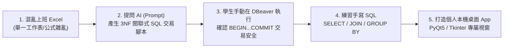
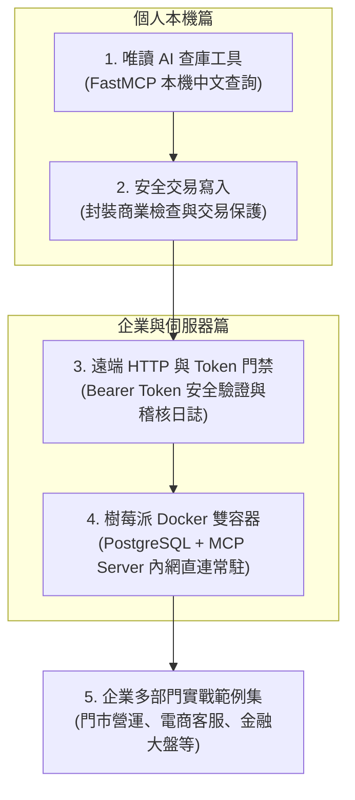

# 🐘 PostgreSQL 職場實戰學習指南

<div align="center">


<br/>

**專為上班族（會計、出納、總務、業務、人資）量身打造！**  
**告別混亂 Excel 痛點 ➡️ 透過 AI 轉換為關聯式 SQL 交易檔 ➡️ 在 DBeaver 親自動手執行 ➡️ 打造專屬個人本機桌面小 App（PyQt5 / Tkinter）**

</div>

---

## 🎯 核心教學理念與安全規範

> [!IMPORTANT]
> **本專案的核心目標是「讓學員扎實學會 SQL 與資料庫架構」，嚴格遵循以下三大規範：**
> 
> 1. **AI 是助教，手寫才是真功夫**：所有 Prompt **嚴禁**讓 MCP 在背景自動建立或修改資料庫！AI 的任務是提供結構建議與 SQL 程式碼區塊，學員必須親自在 **DBeaver** 中檢視並手動執行。
> 2. **拒絕線上架站繁瑣，聚焦個人本機桌面軟體**：捨棄需要伺服器與雲端維運的 Web / Streamlit 線上版，專注使用 **PyQt5**（高質感商業管理視窗）與 **Tkinter**（Python 內建、免繁複環境安裝），開發在自己電腦上即開即用的個人管理小工具。
> 3. **Python 程式中全數手寫 SQL**：在桌面 App 的按鈕與表格背後，使用 `psycopg2` 撰寫原生 SQL 語法（`cursor.execute("SELECT ...")`），體會 SQL 如何靈活驅動桌面視窗畫面。

---

## 🚀 第一次來？這樣開始

1. **選環境**：有樹莓派走 [Docker 方案](./raspberry_docker安裝/)，沒有就走 [Supabase 雲端方案](./supabase安裝/)（最快）。
2. **照順序走**：第 1 章走到第 7 章，每一章都接著前一章。
3. **每課都親手打**：看懂不等於會寫。每課結尾的 ✅ 過關檢查都打勾了，再往下走。
4. **卡住了**：先看該課的「⚠️ 常見卡關」，再把 SQL 和錯誤訊息貼給 AI，問它「錯在哪裡，為什麼」。

| 章 | 主題 | 預估時間 | 完成後你能 |
|:---:|---|:---:|---|
| 1 | [環境安裝](#1-環境安裝) | 1～2 小時 | 用 DBeaver 連上自己的資料庫 |
| 2 | [範例資料庫](#2-範例資料庫) | 30 分鐘 | 匯入五大職場範例 |
| 3 | [用中文查資料庫](#3-自然語言查庫初體驗免寫-sql) | 1 小時 | 不寫 SQL 也能問 AI 查資料 |
| 4 | [SQL 語法與練功](#4-sql-語法與實戰練功) | 10 小時 | **親手寫出跨表報表，並抓出 AI 的錯** |
| 5 | [Python 串接](#5-python-串接psycopg2) | 3 小時 | 用程式自動查詢，並防止資料庫被駭 |
| 6 | [自訂 MCP Server](#6-讓自己的-ai-可以查詢自己的資料庫自訂-mcp-server) | 6～10 小時 | 讓 AI 只能呼叫你設計的工具 |
| 7 | [桌面 App 專題](#7-實戰專案規格驅動開發-sdd打造-5-大職場個人桌面-app) | 每個 4～8 小時 | 做出工作用得上的小工具 |

**只想學 SQL？** 做完第 1、2 章，直接跳到第 4 章。

---

## 🗺️ 學習四階段路線


| 階段 | 章節模組 | 你會學到與產出 | 使用工具與環境 |
|:---:|---|---|---|
| **一** | **[1. 環境安裝](#1-環境安裝)**<br>**[2. 範例資料庫](#2-範例資料庫)**<br>**[3. 自然語言查庫初體驗](#3-自然語言查庫初體驗免寫-sql)** | • 安裝 PostgreSQL（樹莓派 Docker / Supabase）與 DBeaver<br>• 匯入 5 大職場範例庫（報銷、差勤、資產、門市、CRM）<br>• 體驗自備 Excel 轉 SQL 交易檔流程與中文自然語言查庫 | Docker / Supabase / DBeaver / Antigravity |
| **二** | **[4. SQL 語法與實戰練功](#4-sql-語法與實戰練功)** | • **講義與實戰題合一**：完整 DDL、DML、JOIN、JSONB<br>• 每課都有職場情境、真實執行結果、常見卡關與附答案的練習<br>• 每課附 AI 提示詞，學生親手在 DBeaver 執行 | DBeaver + Antigravity 對話 |
| **三** | **[5. Python 串接](#5-python-串接psycopg2)**<br>**[6. 讓 AI 查詢自己的資料庫](#6-讓自己的-ai-可以查詢自己的資料庫自訂-mcp-server)** | • 使用 `psycopg2` 進行參數化查詢（`%s` 防注入）與交易管理<br>• **讓 AI 查詢自己的資料庫**：用 FastMCP 寫幾行 Python，AI 就能用中文查庫<br>• 從個人本機查庫，進階到企業 Token 門禁與樹莓派 Docker 容器部署 | Python (`psycopg2`) + FastMCP + Docker |
| **四** | **[7. 職場桌面 App 實戰開發](#7-實戰專案規格驅動開發-sdd打造-5-大職場個人桌面-app)** | • **全課程壓軸大專題**：規格驅動開發 (SDD)，手寫 SQL 貫穿<br>• 結合 **PyQt5** 與 **Tkinter** 打造 5 款職場個人獨立桌面視窗<br>• 會計報銷、人資排班、總務資產、門市營運、業務 CRM | PyQt5 / Tkinter |

---

## 1. 環境安裝

本課程採用**容器化標準（Docker）**或**雲端免安裝託管**，免除繁瑣的原生環境設定。資料庫管理一律使用開源直覺的 **DBeaver** 圖形客戶端：

| 環境 / 安裝方式 | 包含內容 | 推薦對象 | 教學連結 |
|---|---|:---:|:---:|
| 🍓 **Raspberry Pi（Docker 容器推薦）** | 樹莓派 Docker 安裝、PostgreSQL 容器化運行、DBeaver SSH 隧道、專案 MCP 雙容器整合 | 想在家中打造專屬常駐資料庫伺服器者 | [查看教學](./raspberry_docker安裝/) |
| ☁️ **Supabase（免費雲端託管）** | 免硬體！申請免費雲端託管 PostgreSQL、取得連線字串、DBeaver 直連設定 | 零硬體負擔、想隨開即用立即開始者 | [查看教學](./supabase安裝/) |

> 💡 **連線字串格式範例**：`postgresql://使用者名稱:密碼@主機IP:5432/資料庫名稱`
>
> 📖 DBeaver 的常用操作，請見 [DBeaver 速查表](./raspberry_docker安裝/3_dbeaver連線.md#步驟-33dbeaver-常用操作速查表)。

---

## 2. 範例資料庫

資料庫不能紙上談兵！我們針對上班族最常見的 5 大部門職能（會計、人資、總務、店長、業務），設計了最貼合工作實務的繁體中文範例庫：


```mermaid
flowchart LR
    A["1. 混亂上班 Excel<br>(單一工作表/公式雜亂)"] --> B["2. 提問 AI (Prompt)<br>產生 3NF 關聯式 SQL 交易腳本"]
    B --> C["3. 學生手動在 DBeaver 執行<br>確認 BEGIN...COMMIT 交易安全"]
    C --> D["4. 練習手寫 SQL<br>SELECT / JOIN / GROUP BY"]
    D --> E["5. 打造個人本機桌面 App<br>PyQt5 / Tkinter 專屬視窗"]
```

### 🏢 五大職場核心職能範例庫

| 適用職務 | 範例資料庫腳本（點擊查看） | 解決之職場 Excel 痛點 | 後續實戰打造之桌面 App | GUI 技術 |
|---|---|---|---|:---:|
| 💼 **會計 / 出納** | [`expense_tracker.sql`](./範例資料庫/中文範例資料庫/expense_tracker.sql) | 差旅請款單滿天飛、重複報帳、部門預算超支無即時預警 | 費用報銷審核與預算預警系統 | 🔵 **PyQt5** |
| 👥 **人資 (HR)** | [`hr_attendance.sql`](./範例資料庫/中文範例資料庫/hr_attendance.sql) | 手動排班撞期、打卡時數加總繁瑣、加班費與計薪算到眼花 | 排班出勤與加班計薪小工具 | 🟢 **Tkinter** |
| 🏢 **總務 / 倉管** | [`assets_inventory.sql`](./範例資料庫/中文範例資料庫/assets_inventory.sql) | 筆電投影機借出找不到人、耗材臨時斷貨缺安全庫存提醒 | 固定資產借還與耗材管理系統 | 🔵 **PyQt5** |
| ☕ **店長 / 營運** | [`cafe_shop.sql`](./範例資料庫/中文範例資料庫/cafe_shop.sql) | 每月複製一份 Excel 難以跨月對比、明星商品與常客排行 | 門市營運分析與員工提成看板 | 🔵 **PyQt5** |
| 🛒 **業務 / 電商** | [`shop.sql`](./範例資料庫/中文範例資料庫/shop.sql) | 客戶資料與訂單塞在同張表、訂單履約追蹤、RFM 客戶分群 | 客戶 CRM 與訂單履約系統 | 🟢 **Tkinter** |

> [!IMPORTANT]
> **一個範例放一個資料庫，資料庫名稱和檔名相同。** `cafe_shop` 和 `shop` 有同名的資料表，放在一起會互相覆蓋。詳見 [匯入方式](./範例資料庫/中文範例資料庫/#匯入方式)。

* 🌟 **[自備 Excel 轉 SQL 實戰示範](./範例資料庫/excel範例/自備Excel轉SQL實戰示範/)**：附完整「員工差旅與費用報銷單.xlsx」，示範如何請 AI 產出具備 `BEGIN...COMMIT` 的 SQL 交易腳本，並手動在 DBeaver 成功匯入。
* 🚀 **[巨量資料產生器](./範例資料庫/中文範例資料庫/generate_100k_orders.sql)**：免下載任何巨大檔案！PostgreSQL 內建指令 1 秒動態生成 10 萬筆訂單資料，專門用於索引（INDEX）與查詢效能壓測。

---

## 3. 自然語言查庫初體驗（免寫 SQL）

在深入學習 SQL 語法之前，先體驗 AI 賦能的震撼力！  
在 Antigravity 中掛載本專案提供的專案級 MCP（具備唯讀保護 `--access-mode=restricted`），只要在對話框中**用中文問問題，AI 就會自動查詢資料庫並整理成清楚表格回答你**：

* 👉 **[前往實戰：用中文查詢資料庫（以電商 shop 為例）](./MCP操作資料庫/2_用中文查詢資料庫/)**：體驗 AI 自動判斷表格關聯並撈取資料的便利。

---

## 4. SQL 語法與實戰練功

本章是課程的核心，**總時數約 10 小時**。全章跟著「暖光咖啡」總部的王經理，把每天的 Excel 問題變成一句 SQL。每一課都有：**職場情境 → 語法 → 真實執行結果 → 常見卡關 → 附答案的練習 → 問 AI 助教 → 過關檢查**。講義中的 SQL 都實際執行過，結果就是你應該看到的結果。

👉 **[進入第 4 章目錄](./SQL語法教學/README.md)**：含課程地圖、資料庫對照表和 SQL 速查表。

### 📐 DDL：蓋結構（約 2 小時）

| # | 單元主題 | 核心內容 |
|:---:|---|---|
| 導讀 | [DDL 是什麼](./SQL語法教學/DDL%28定義資料語言%29.md) | CREATE、ALTER、DROP、TRUNCATE |
| 1 | [建立資料庫](./SQL語法教學/1建立資料庫.md) | `CREATE DATABASE`、切換資料庫、命名規則 |
| 2 | [基本型別](./SQL語法教學/2_0基本型別.md) | 金額為什麼不能用 FLOAT、電話為什麼是文字 |
| 3 | [建立資料表](./SQL語法教學/2建立資料表.md) | `CREATE TABLE`、`ALTER TABLE` |
| 4 | [匯入 CSV](./SQL語法教學/2_1匯入csv.md) | DBeaver 匯入、驗筆數、亂碼處理 |
| 5 | [限制條件](./SQL語法教學/4限制.md) | `PRIMARY KEY`、`NOT NULL`、`UNIQUE`、`CHECK`、`DEFAULT` |

### 🔍 DML：操作資料（約 3.5 小時）

| # | 單元主題 | 核心內容 |
|:---:|---|---|
| 導讀 | [DML 是什麼](./SQL語法教學/DML%28資料操作語言%29.md) | **匯入 `cafe_shop`**，開工準備 |
| 1 | [新增資料](./SQL語法教學/3新增資料.md) | `INSERT`、`RETURNING`、單引號的坑 |
| 2 | [查詢資料](./SQL語法教學/6取得資料.md) | `SELECT`、`WHERE`、`ORDER BY`、`LIMIT` |
| 3 | [修改與刪除](./SQL語法教學/5修改和刪除.md) | `UPDATE`、`DELETE`、保命三步驟與交易 |
| 4 | [外來鍵](./SQL語法教學/7_0FOREIGN_KEY.md) | 父子表、`ON DELETE` 怎麼選 |
| 5 | [JOIN](./SQL語法教學/JOIN.md) | SQL 版的 VLOOKUP：五種 JOIN |
| 6 | [JSONB](./SQL語法教學/16json.md) | 飲料客製化、`->` 和 `->>` |

### 💡 思維躍升：從單一工作表到多張表（約 40 分鐘）

> [!NOTE]
> 單一工作表裡，客戶電話一改就要改幾百列，刪掉訂單連客戶資料都不見。拆成多張表，再用主鍵和外來鍵串起來，這些問題就消失了。

- 👉 **[必讀觀念：從 Excel 到關聯式資料庫](./範例資料庫/從Excel到關聯資料庫_正規化.md)**
- 👉 **[快速上手：一對多關聯](./SQL語法教學/7.0適合初學者關聯資料庫.md)**

### 🧩 關聯資料庫進階實戰（約 5 小時）

| # | 單元主題 | 核心內容 | 練習腳本 |
|:---:|---|---|:---:|
| 1 | [建立七張表](./SQL語法教學/7創建關聯資料庫.md) | 親手蓋出 `cafe_shop`、多對多設計 | — |
| 2 | [關聯新增](./SQL語法教學/8新增關聯資料庫資料.md) | 寫入順序、交易、SERIAL 撞號 | [.sql](./SQL語法教學/8新增關聯資料庫資料.sql) |
| 3 | [關聯搜尋](./SQL語法教學/9搜尋關聯資料庫.md) | 拆解問題的三個步驟 | [.sql](./SQL語法教學/9搜尋關聯資料庫.sql) |
| 4 | [聚合與分組](./SQL語法教學/10聚合函式.md) | SQL 版樞紐分析表：`GROUP BY`、`HAVING` | [.sql](./SQL語法教學/10聚合函式.sql) |
| 5 | [模糊搜尋](./SQL語法教學/11萬用字元.md) | `LIKE`、`ILIKE`、`%`、`_` | [.sql](./SQL語法教學/11萬用字元.sql) |
| 6 | [聯集](./SQL語法教學/12聯集.md) | `UNION`、`UNION ALL` | [.sql](./SQL語法教學/12聯集.sql) |
| 7 | [綜合連結](./SQL語法教學/13連結.md) | 條件放 `ON` 還是 `WHERE` | [.sql](./SQL語法教學/13連結.sql) |
| 8 | [子查詢](./SQL語法教學/14子查詢.md) | `WITH`、`EXISTS`、`NOT IN` 遇到 NULL 的大坑 | [.sql](./SQL語法教學/14子查詢.sql) |
| 9 | [ON DELETE](./SQL語法教學/15on_delete_action.md) | 查規則、預測後果、軟刪除 | [.sql](./SQL語法教學/15on_delete_action.sql) |
| 10 | [AI 助教與結業挑戰](./SQL語法教學/關聯資料庫實作_用Prompt操作.md) | 抓出 AI 的錯、五大職務實戰、結業五題 | — |

---

## 5. Python 串接（psycopg2）

學會 SQL 語法後，我們使用 Python 官方標準驅動套件 `psycopg2` 進行連線。本章節著重於**程式架構安全與交易完整性**，引導學員建立穩健的資料庫應用習慣：

```python
import os
import psycopg2
from dotenv import load_dotenv

load_dotenv()  # 從 .env 讀取連線資訊，密碼不寫在程式裡

conn = psycopg2.connect(
    host=os.getenv("DB_HOST"), port=os.getenv("DB_PORT"), dbname=os.getenv("DB_NAME"),
    user=os.getenv("DB_USER"), password=os.getenv("DB_PASSWORD"),
)

# with conn：成功自動 commit，出錯自動 rollback
with conn:
    with conn.cursor() as cur:
        # 嚴禁字串拼接！一律用 %s 參數化，防止 SQL Injection
        cur.execute("SELECT order_id, order_date, status FROM orders WHERE store_id = %s LIMIT 3;", (1,))
        for row in cur.fetchall():
            print(row)

conn.close()
```

👉 **[進入第 5 章目錄](./python/)**

1. [安裝與環境設定](./python/安裝和介紹)：使用 `.env` 保管帳密，建立虛擬環境與安裝 `psycopg2-binary`。
2. [基本查詢與操作](./python/basic_module_usage)：執行 `SELECT` 撈取資料與游標（Cursor）運用。
3. [使用 with 語法](./python/with)：掌握 Python 資源管理器，異常時自動 `rollback`，成功自動 `commit`。
4. [安全參數化傳遞](./python/parameter)：**徹底杜絕 SQL Injection 漏洞**，全面使用 `%s` 佔位符。
5. [資料型別對應](./python/type)：PostgreSQL 與 Python 型別轉換（日期時間、NUMERIC 轉 float、JSONB 轉 dict）。
6. [例外處理機制](./python/exception)：補捉 `psycopg2.Error`，保障視窗應用程式不當機崩潰。

---

## 6. 讓自己的 AI 可以查詢自己的資料庫（自訂 MCP Server）

在學會了 SQL 與 Python 串接後，最實用、最有成就感的一步，就是**讓平常對話的 AI，具備專屬於你的大腦——可以直接用中文查詢你自己電腦上的資料庫！**

你不再需要手動把資料匯出成 Excel 丟給 AI，也不需要架設複雜的 Web 後端網站。透過 **MCP（Model Context Protocol）**，只要用 Python (FastMCP) 寫幾行查詢小工具，你的 AI 就能化身為專屬查庫助理，直接在聊天對話框中幫你找出客戶訂單、庫存警報、出勤打卡或營業額！

本章採用大白話教學與循序漸進架構：**「從個人本機專屬助理 $\rightarrow$ 升級到具備 Token 門禁的企業級安全服務與樹莓派 Docker 雙容器常駐」**。


```mermaid
flowchart TD
    subgraph 個人本機篇
        M1["1. 唯讀 AI 查庫工具<br>(FastMCP 本機中文查詢)"] --> M2["2. 安全交易寫入<br>(封裝商業檢查與交易保護)"]
    end
    subgraph 企業與伺服器篇
        M2 --> M3["3. 遠端 HTTP 與 Token 門禁<br>(Bearer Token 安全驗證與稽核日誌)"]
        M3 --> M4["4. 樹莓派 Docker 雙容器<br>(PostgreSQL + MCP Server 內網直連常駐)"]
    end
    M4 --> M5["5. 企業多部門實戰範例集<br>(門市營運、電商客服、金融大盤等)"]
```

| 階段 | 單元模組 | 你的角色 | 學習重點與實作內容 |
|:---:|---|:---:|---|
| **個人篇** | **[1. 用 AI 建立自己的 MCP Server（唯讀）](./mcp_server/1_用AI建立MCP_server/)** | 需求設計與開發者 | • 在本機規劃資料查詢工具，使用 FastMCP 撰寫 Python 邏輯<br>• 透過 MCP Inspector 進行本機視覺化除錯，掛載到 Antigravity 中文查庫 |
| **個人篇** | **[2. 會寫入資料的 MCP Server（安全交易）](./mcp_server/2_寫入型MCP_server/)** | 架構設計與驗收者 | • 圖書館借還書情境：嚴格限制寫入介面，商業檢核寫在程式中<br>• 確保資料庫交易（Transaction `BEGIN...COMMIT`）具備原子性 |
| **企業篇** | **[3. 企業導入：遠端 MCP 與 Token 門禁](./mcp_server/3_企業導入_遠端MCP與token/)** | 系統導入工程師 | • 升級為 Streamable HTTP 遠端微服務架構<br>• 導入 Bearer Token 門禁驗證機制，即時記錄每次呼叫的審計日誌 |
| **企業篇** | **[4. 正式上線：部署至樹莓派 Docker 雙容器](./mcp_server/4_樹莓派Docker容器部署/)** | 系統架構師 | • 撰寫 `Dockerfile` 與 `docker-compose.yml`<br>• 將 MCP 與 PostgreSQL 一同打包至樹莓派內網，免開外部 Port 兼顧極速與安全 |
| **綜合篇** | **[5. 企業各部門範例集](./mcp_server/5_範例集/)** | 參考與最佳實踐 | • 提供電商客服、門市營運、金融大盤等完整範例程式碼（本機/遠端雙模） |

---

## 7. 實戰專案：規格驅動開發 SDD（打造 5 大職場個人桌面 App）

當我們掌握了手寫 SQL 語法、Python 驅動程式，並且擁有專屬的 AI 查庫助理後，我們邁向全課程的**壓軸實戰專案**！

我們採用現代軟體工程的 **規格驅動開發 (SDD, Spec-Driven Development)**：透過 `PRD.md` 規範商業功能，由 AI 閱讀資料庫結構並引導架構，學員在自己電腦上以純本機視窗（**PyQt5** 與 **Tkinter**）親手手寫 SQL，開發出完全屬於自己的 5 大職場桌面管理工具！

**本目錄 5 大實戰專案，100% 完整對應五大職場範例資料庫！**

| 專案目錄 | 對應範例庫 | 本機 GUI 框架 | 職場角色 | 核心手寫 SQL 技術與亮點功能 |
|---|---|:---:|:---:|---|
| **[project1_expense_manager](./app_projects/project1_expense_manager/)** | `expense_tracker.sql` | 🔵 **PyQt5** | 💼 會計 / 出納 | • **報銷案件審批流程**：待審/核准/駁回狀態流動<br>• **手寫 SQL 預算對比**：聚合查詢各部門年度核定預算 vs 累計支出<br>• **超支預警機制**：支出率達 80% 自動變色警示 |
| **[project2_hr_attendance](./app_projects/project2_hr_attendance/)** | `hr_attendance.sql` | 🟢 **Tkinter** | 👥 人資 (HR) | • **排班打卡核對網格**：手寫 SQL `CASE WHEN` 判定遲到/早退<br>• **加班工時試算**：平日與假日加班時數分類加總<br>• **月底計薪結算機**：勞基法費率試算應發薪資總額 |
| **[project3_assets_inventory](./app_projects/project3_assets_inventory/)** | `assets_inventory.sql` | 🔵 **PyQt5** | 🏢 總務 / 倉管 | • **固定資產借還登記**：手寫 SQL 篩選逾期未歸還名冊與天數<br>• **耗材安全庫存預警**：庫存低於預警線自動標記「建議採購」<br>• **部門領用追蹤**：領用即時扣庫存並留存完整歷史紀錄 |
| **[project4_cafe_dashboard](./app_projects/project4_cafe_dashboard/)** | `cafe_shop.sql` | 🔵 **PyQt5** | ☕ 門市店長 | • **跨月營收戰情室**：解決多份 Excel 拼湊痛點，即時跨月切換<br>• **明星熱銷排行**：手寫 SQL `GROUP BY` 與視窗函式計算商品佔比<br>• **員工提成計算**：銷售杯數階梯試算各店員當月提成獎金 |
| **[project5_shop_crm](./app_projects/project5_shop_crm/)** | `shop.sql` | 🟢 **Tkinter** | 🛒 業務 / 電商 | • **主從訂單履約**：點選訂單，下方手寫 SQL JOIN 即時帶出明細品項<br>• **訂單狀態流水線**：未處理 ➡️ 已出貨 ➡️ 已完成流動控管<br>• **RFM 客戶價值模型**：試算消費頻次與貢獻金額，標記 VIP 客戶 |

---

<div align="center">
<b>為自己的日常工作賦能，從手寫每一句 SQL 開始！</b>
</div>
