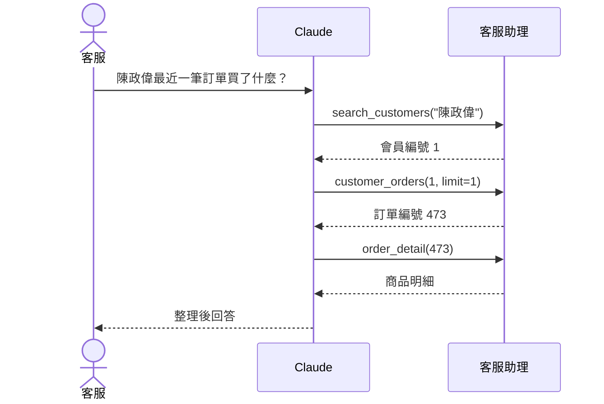

# 範例 1：🛒 網路商店客服助理

程式：[shop_service.py](./shop_service.py)　資料庫：[shop.sql](../../範例資料庫/中文範例資料庫/#-網路商店-shop)　[← 回範例集](./README.md)

## 情境

客服人員接到會員來電：「我上個月買的東西還沒到」。以前要開好幾個系統查詢，現在直接問 Claude。

## 工具

| 工具 | 用途 | 參數 |
|---|---|---|
| `search_customers` | 用姓名或 email 找會員，取得**會員編號** | 關鍵字 |
| `customer_orders` | 某位會員最近的訂單（最多 50 筆） | 會員編號、筆數 |
| `order_detail` | 一筆訂單買了哪些商品 | 訂單編號 |
| `orders_by_status` | 依狀態列出訂單（已完成／已取消／配送中） | 狀態、筆數 |

## 可以這樣問

- 「幫我找姓陳、住在高雄的會員」
- 「會員編號 1 最近買了什麼？每筆訂單的商品明細是什麼？」
- 「目前有哪些訂單還在配送中？」
- 「陳政偉這位會員 2025 年總共花了多少錢？」

## 學到的技巧

### 1. 一個問題，Claude 會連續呼叫好幾個工具



工具說明裡寫「**查詢會員訂單前，先用這個工具取得會員編號**」，Claude 就知道要先找會員編號。

### 2. 個資最小化

客服只需要確認身分，不需要看到完整個資：

```python
# 不回傳生日,email 只顯示前 3 個字元
LEFT(email, 3) || '***@' || SPLIT_PART(email, '@', 2) AS email     -- user001@example.com → use***@example.com
```

`MCPServer(instructions="……不要透露會員的完整 email。")` 再提醒 AI 一次。**但真正的保護是 SQL 根本不回傳**，不能只靠提醒 AI。

## 產生這個範例的提示詞

````markdown
請參考 common.py 的寫法,用 MCP Python SDK(mcp 2.x 的 MCPServer)建立「網路商店客服助理」MCP Server。
使用者是客服人員,接到會員來電時查詢會員、訂單與配送狀況。

## 規定
- 使用 common.py 的 query()、audit()、run(),每個工具開頭都要呼叫 audit()
- 所有參數用 %s 參數化查詢;訂單狀態用 Literal["已完成", "已取消", "配送中"] 限定
- 個資最小化:不回傳生日;email 只顯示前 3 個字元,例如 use***@example.com
- 列表類的工具最多回傳 50 筆
- 工具說明用繁體中文;查會員訂單前要先取得會員編號,請寫在工具說明裡

## 資料表
【貼上 shop.sql 的 CREATE TABLE 語法】

## 工具
1. search_customers(keyword):用姓名或 email 搜尋會員
2. customer_orders(customer_id, limit):某會員最近的訂單,包含商品金額與運費
3. order_detail(order_id):訂單的商品明細
4. orders_by_status(status, limit):依狀態列出訂單
````

## 延伸挑戰

1. 新增 `order_shipping_fee_check(order_id)`：檢查運費是否正確（商品金額滿 999 元應該免運）
2. 新增 `customer_summary(customer_id)`：會員的總消費金額、訂單數、最常買的分類
3. 思考：如果客服要能**取消訂單**，工具要怎麼設計？需要哪些安全檢查？
