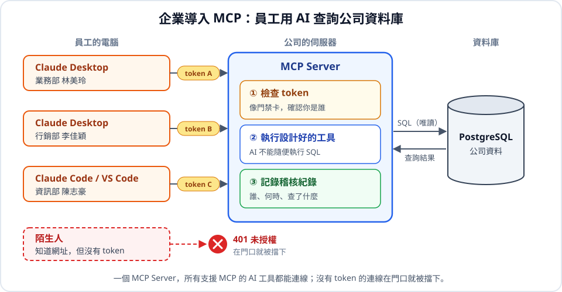
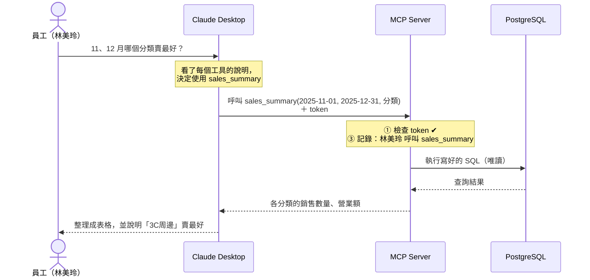
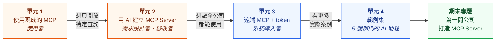
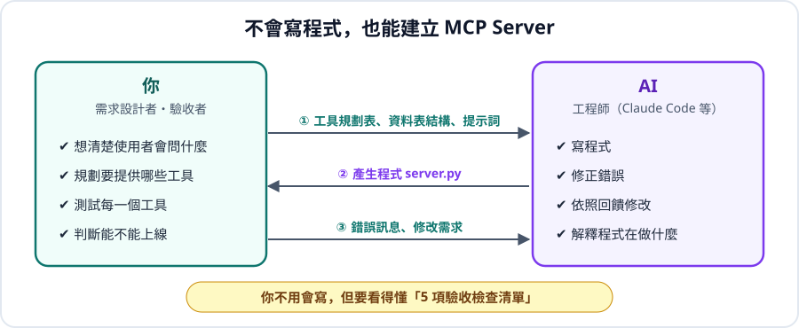

# AI 連接資料庫：MCP Server

公司的資料都在資料庫裡，但大部分員工不會寫 SQL。
**企業只要導入 MCP Server，員工就能在 Claude Desktop 這類 AI 桌面應用程式裡，直接用中文問問題，AI 會自己去資料庫查資料。**

> 「上個月哪個分類賣最好？」「有哪些商品快缺貨了？」
> → AI 呼叫公司的 MCP Server → MCP Server 查詢 PostgreSQL → AI 整理成表格回答

---

## 企業導入 MCP 的樣子

學完這個章節，你要能說明這三件事：

| | 重點 | 說明 |
|:---:|---|---|
| 1 | **MCP 是 AI 的標準接口** | 公司寫好一個 MCP Server，Claude Desktop、Claude Code、VS Code 等支援 MCP 的 AI 工具都可以連線使用，不用各寫一套 |
| 2 | **只開放設計好的工具** | AI 不能隨便執行 SQL，只能呼叫公司設計好的查詢，資料比較安全，結果也比較穩定 |
| 3 | **連線一定要使用 token** | 沒有 token，任何知道網址的人都能查公司資料。token 用來確認「你是誰」、記錄誰查了什麼，員工離職也能立刻停用 |

### 員工問一個問題，背後發生了什麼事？

> 💡 **AI 從頭到尾都沒有自己寫 SQL**，它只是「挑選工具、填入參數」，真正的 SQL 是公司事先寫好的。

---

## 學習路線

| 單元 | 你的角色 | 內容 | 連線方式 |
|:---:|---|---|---|
| [1. 使用現成的 MCP Server](./1_postgres_mcp_pro/) | 使用者 | 安裝別人寫好的 Postgres MCP Pro，體驗用自然語言查詢資料庫 | 本機 |
| [2. 用 AI 建立自己的 MCP Server](./2_用AI建立MCP_server/) ⭐ | 需求設計者、驗收者 | 規劃工具 → 請 AI 寫程式 → 測試 → 接上 Claude Desktop | 本機 |
| [3. 企業導入：遠端 MCP 與 token](./3_企業導入_遠端MCP與token/) ⭐ | 系統導入者 | 把 MCP Server 架在伺服器上，員工帶 token 連線，並留下稽核紀錄 | 遠端 + token |
| [4. 範例集](./4_範例集/) | 參考、示範 | 網路商店客服、教務處、圖書館、YouBike、股市，5 個部門的 AI 助理 | 本機或遠端 |
| [期末專題](#期末專題) | 全部 | 用 AI 為一間「公司」打造專屬的 MCP Server | 遠端 + token |

---

## 不會寫程式，也能建立 MCP Server

本課程的程式都是**請 AI 寫的**。你不需要從零開始寫 Python，但你要做好這三件事：

| 你負責 | AI 負責 |
|---|---|
| 想清楚使用者會問什麼問題、需要哪些工具 | 寫程式 |
| 把資料表結構和需求清楚地告訴 AI | 修正錯誤 |
| 測試、驗收，檢查 AI 有沒有做到安全規定 | 依照你的回饋修改 |

AI 寫的程式不一定正確，所以你仍然要**看得懂關鍵的 5 個地方**，才能判斷能不能交給公司使用 👉 [檢查清單](./2_用AI建立MCP_server/#步驟-3看懂-ai-寫的程式)

---

## 名詞對照

| 名詞 | 白話說明 |
|---|---|
| **MCP**（Model Context Protocol） | AI 連接外部工具與資料的標準規格，就像 USB 是電腦連接裝置的標準 |
| **MCP Client** | AI 這一端，例如 Claude Desktop、Claude Code、VS Code |
| **MCP Server** | 提供工具給 AI 呼叫的程式，例如「查詢銷售統計」「列出缺貨商品」 |
| **Tool（工具）** | MCP Server 裡的一個功能，AI 會依照工具的說明決定要不要呼叫 |
| **stdio（本機）** | MCP Server 在自己的電腦上執行，只有自己能用（單元 1、2） |
| **Streamable HTTP（遠端）** | MCP Server 架在伺服器上，用網址連線，多人共用（單元 3） |
| **Token** | 一串很長的亂數密碼，就像公司的門禁卡，連線時要出示 |
| **Bearer Token** | 把 token 放在 HTTP 標頭 `Authorization: Bearer <token>` 傳給伺服器的方式 |

---

## 期末專題

以小組為單位，扮演一間公司的 IT 部門，**用 AI 建立一個遠端 MCP Server**，讓「員工」用 Claude Desktop 帶 token 連線查詢。

**資料庫（擇一）**：課程中任何一個範例資料庫（[中文範例資料庫](../範例資料庫/中文範例資料庫/)、台鐵、YouBike、股市）

> ⚠️ [範例集](./4_範例集/)已經有的「使用者角色」不能直接沿用。請換一個角色，例如：
> 學校選課 → **學生自己**、**系主任**；圖書館 → **讀者**、**採購人員**；網路商店 → **倉管人員**、**行銷人員**

| 項目 | 要求 |
|---|---|
| 情境 | 說明使用者是誰，以及他們常問的 5 個問題 |
| 工具 | 至少 3 個範例集沒有的工具，附上[工具規劃表](./2_用AI建立MCP_server/#步驟-1規劃工具) |
| 安全 | 通過[檢查清單](./2_用AI建立MCP_server/#步驟-3看懂-ai-寫的程式)：唯讀、參數化查詢、限制回傳筆數 |
| token | 每位組員一組 token，展示錯誤 token 被拒絕、稽核紀錄看得到每個人查了什麼 |
| 展示 | 現場用 Claude Desktop 問 5 個問題，並說明 AI 呼叫了哪個工具 |
| 繳交 | 工具規劃表、給 AI 的提示詞、最後的程式、展示截圖 |

---

## 參考資料

- [MCP 官方網站](https://modelcontextprotocol.io/)
- [MCP Python SDK](https://github.com/modelcontextprotocol/python-sdk)
- [Postgres MCP Pro](https://github.com/crystaldba/postgres-mcp)
- [Claude：新增自訂連接器（custom connector）](https://claude.com/docs/connectors/custom/remote-mcp)
