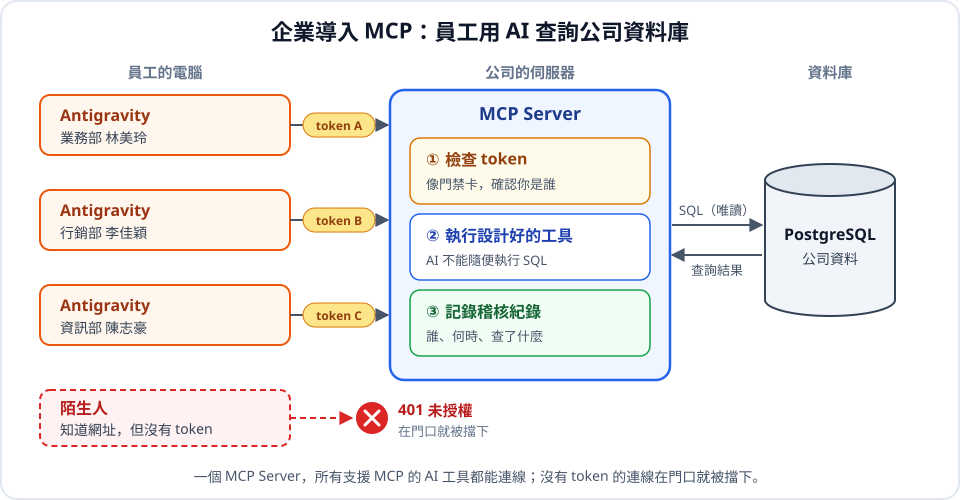
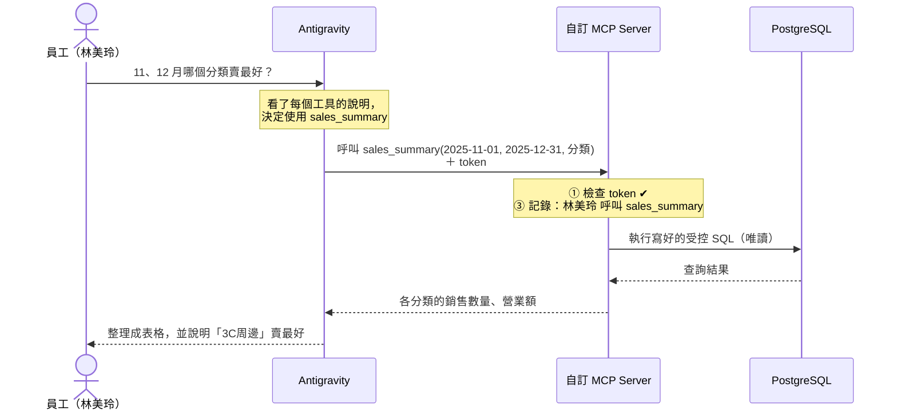
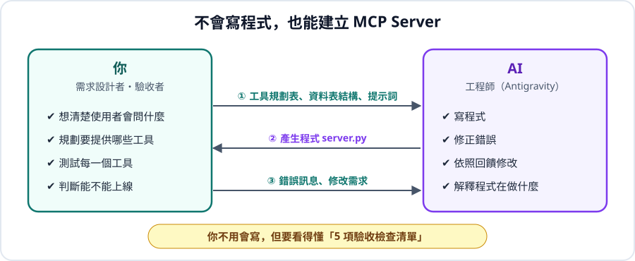

# 第 8 章：自訂 MCP Server（壓軸單元：企業導入與客製化開發）

> 📌 **先修**：
> - [第 3 章 安裝現成 MCP](../MCP操作資料庫/)（體驗過自然語言查庫）
> - [第 4-5 章 SQL 語法與練習](../上課用sql/)（看得懂 SQL 與資料庫關聯）
> - [第 6-7 章 Python 串接與實戰專案](../README.md#6-python-串接psycopg2)（具備 Python 程式基礎）

在第 3 章中，我們使用的是別人寫好的開源 MCP（例如 `postgres-mcp`），AI 可以任意執行 SQL。
但在真實企業環境中，**我們不能讓 AI 隨意下 SQL，也不能讓沒有權限的人隨意撈取機敏資料**。

**在全書的最後一章，我們要用 Python（FastMCP）親手打造專屬的自訂 MCP Server！**
只把公司審核通過的特定商業邏輯包裝成 Tool（例如「查詢銷售統計」、「列出缺貨清單」），並加上 Token 身分驗證與安全稽核，最後在 **Antigravity IDE** 中進行專案級掛載與測試。

---

## 企業導入 MCP 的樣子

學完這個章節，你要能掌握這三件事：

| | 重點 | 說明 |
|:---:|---|---|
| 1 | **MCP 是 AI 的標準接口** | 寫好一個 MCP Server，Antigravity、VS Code 等支援 MCP 的 AI 工具都可以掛載使用，不用為每個 AI 介面各寫一套 |
| 2 | **只開放設計好的工具** | AI 不能隨便亂下 SQL，只能呼叫我們設計好的受控 Tool，資料更安全、查詢更穩定 |
| 3 | **連線一定要使用 Token** | 沒有 Token 不能查資料。Token 用來確認身分、記錄誰查了什麼，離職也能立刻註銷 |

### 員工問一個問題，背後發生了什麼事？

```mermaid
sequenceDiagram
    actor 員工 as 員工（林美玲）
    participant AI as Antigravity
    participant MCP as 自訂 MCP Server
    participant DB as PostgreSQL

    員工->>AI: 11、12 月哪個分類賣最好？
    Note over AI: 看了每個工具的說明，<br/>決定使用 sales_summary
    AI->>MCP: 呼叫 sales_summary(2025-11-01, 2025-12-31, 分類)<br/>＋ token
    Note over MCP: ① 檢查 token ✔<br/>③ 記錄：林美玲 呼叫 sales_summary
    MCP->>DB: 執行寫好的受控 SQL（唯讀）
    DB-->>MCP: 查詢結果
    MCP-->>AI: 各分類的銷售數量、營業額
    AI-->>員工: 整理成表格，並說明「3C周邊」賣最好
```

> 💡 **AI 從頭到尾都沒有自己拼湊危險的 SQL**，它只是「挑選合適的 Tool、填入參數」，真正的 SQL 是我們在 FastMCP 程式裡寫好的安全查詢。

---

## 本章學習路線

```mermaid
flowchart LR
    P["<b>第 3-7 章</b><br/>SQL & Python 基礎<br/><i>先修完成</i>"]
    U1["<b>單元 1</b><br/>用 Python 建立 MCP Server<br/><i>FastMCP 工具設計</i>"]
    U2["<b>單元 2</b><br/>遠端 MCP + Token 驗證<br/><i>企業安全架構</i>"]
    U3["<b>單元 3</b><br/>範例集<br/><i>5 個部門的 AI 助理</i>"]
    U4["<b>單元 4</b><br/>安全寫入型<br/>MCP Server"]
    F["<b>期末專題</b><br/>為企業打造專屬<br/>MCP Server"]
    P -->|"封裝商業邏輯"| U1 -->|"讓團隊共用"| U2 --> U3 -->|"開放受控寫入"| U4 --> F

    classDef pre fill:#f8fafc,stroke:#94a3b8,color:#334155
    classDef local fill:#fff7ed,stroke:#ea580c,color:#7c2d12
    classDef remote fill:#eff6ff,stroke:#2563eb,color:#1e3a8a
    classDef final fill:#f0fdf4,stroke:#16a34a,color:#14532d
    class P pre
    class U1,U4 local
    class U2,U3 remote
    class F final
```

| 單元 | 你的角色 | 內容 | 連線方式 |
|:---:|---|---|---|
| [1. 用 AI 建立自己的 MCP Server](./1_用AI建立MCP_server/) ⭐ | 需求設計者、開發者 | 規劃工具 → 撰寫 FastMCP 程式 → 測試 → 在 Antigravity 中專案掛載 | 本機 stdio |
| [2. 企業導入：遠端 MCP 與 token](./2_企業導入_遠端MCP與token/) ⭐ | 系統導入者 | 把 MCP Server 架在伺服器上，員工帶 token 連線，留下稽核紀錄 | 遠端 + token |
| [3. 範例集](./3_範例集/) | 參考、示範 | 網路商店客服、教務處、圖書館、YouBike、股市，5 個部門的 AI 助理 | 本機或遠端 |
| [4. 會寫入資料的 MCP Server](./4_寫入型MCP_server/) | 需求設計者、驗收者 | 圖書館借還書：只開放特定寫入、檢查寫在程式裡、交易與稽核 | 本機 |
| [期末專題](#期末專題) | 全部 | 親手為一間「公司」打造專屬的 MCP Server | 遠端 + token |

---

## 你與 AI 的協同開發模式

在 Antigravity IDE 中開發 MCP Server 時，你不需要從空白文字檔自己刻全部語法，你可以透過 Antigravity AI 協作：

| 你負責 | AI 負責 |
|---|---|
| 想清楚使用者會問什麼問題、需要哪些受控工具 | 產生 FastMCP 骨架與 SQL 查詢函式 |
| 把資料表結構和安全限制清楚地告訴 AI | 修正錯誤與補齊型別檢查 |
| 測試、驗收，確認 Tool 的回傳格式正確 | 依照你的回饋微調工具參數與 docstring |

---

## 核心名詞對照

| 名詞 | 白話說明 |
|---|---|
| **MCP**（Model Context Protocol） | AI 連接外部工具與資料的標準規格，就像 USB 是電腦連接週邊的標準 |
| **MCP Client** | AI 這一端，本課程使用 **Antigravity** |
| **專案級 MCP** | 設定在專案目錄 `.agents/mcp_config.json`，免全域安裝，只在開啟專案時啟動 |
| **MCP Server** | 提供受控工具給 AI 呼叫的伺服程式，例如「查詢銷售統計」、「列出缺貨商品」 |
| **Tool（工具）** | MCP Server 裡定義的具體功能函式，AI 會根據 Tool 的 docstring 說明決定何時呼叫 |
| **stdio（本機）** | MCP Server 在本機作為子程序啟動，透過標準輸入輸出溝通 |
| **Streamable HTTP（遠端）** | MCP Server 架在伺服器上，透過網路 URL 提供多人共用 |
| **Token** | 身分驗證金鑰，連線時必須附帶，確保只有授權員工才能使用 |

---

## 期末專題

以小組或個人為單位，扮演一間公司的系統架構師，**打造一個自訂 MCP Server**，讓使用者在 Antigravity 中帶 token 連線查詢（亦可加入安全受控的寫入功能）。

**資料庫（擇一）**：課程中任何一個範例資料庫（[中文範例資料庫](../範例資料庫/中文範例資料庫/)、台鐵、YouBike、股市）

| 項目 | 要求 |
|---|---|
| 情境設計 | 說明目標使用者是誰，以及他們最常問的 5 個業務問題 |
| 工具規劃 | 至少 3 個自訂工具，附上工具規劃表（輸入參數、回傳結構） |
| 安全規範 | 堅持參數化查詢（防止 SQL Injection）、限制單次最大回傳筆數 |
| 寫入控制（加分） | 若有寫入工具，需實作身分檢查、業務條件驗證與資料庫交易（Transaction） |
| 測試掛載 | 在本專案 `.agents/mcp_config.json` 掛載測試，展示 Antigravity 能正確識別並呼叫工具 |
