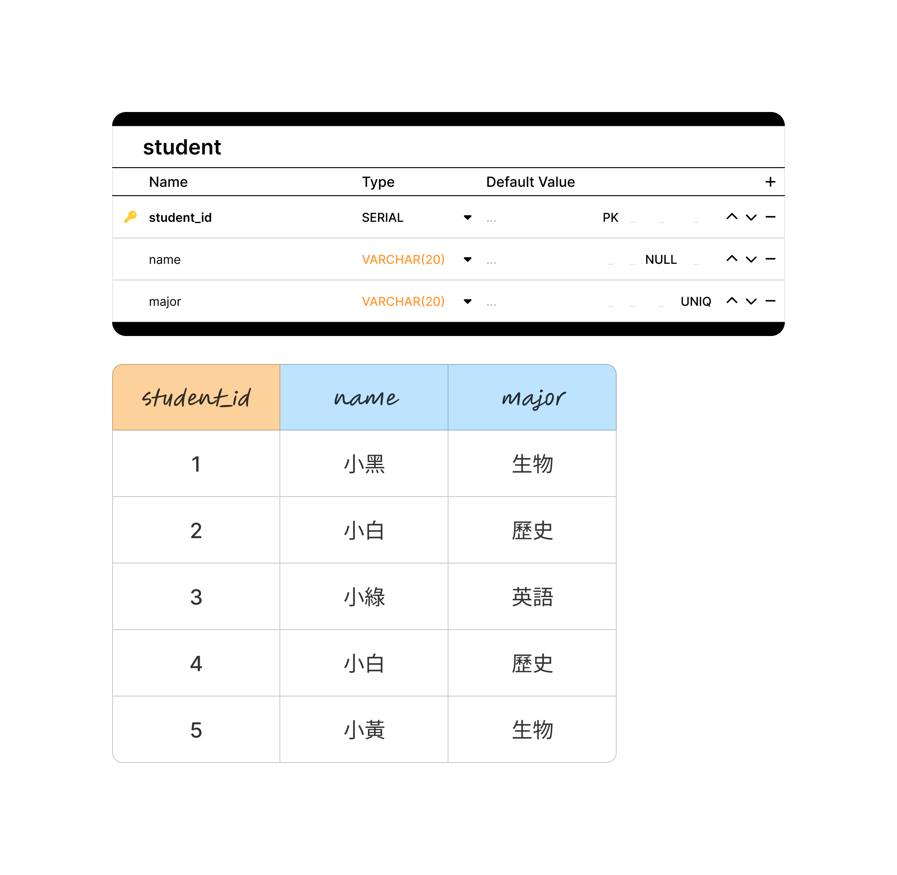

# PostgreSQL 基本資料類型

## 字串類型 (String Types)

- **VARCHAR** - 可變長度字串，無長度限制
- **VARCHAR(n)** - 可變長度字串，最大長度為 n 個字符
- **TEXT** - 無長度限制的文字類型，適合儲存大量文字內容

## 整數數值類型 (Integer Types)

- **SMALLINT** - 2位元組整數
  - 範圍：-32,768 到 32,767
- **INT** - 4位元組整數
  - 範圍：-2,147,483,648 到 2,147,483,647
- **BIGINT** - 8位元組整數
  - 範圍：-9,223,372,036,854,775,808 到 +9,223,372,036,854,775,807
- **SERIAL** - 自動遞增整數
  - 具有 AUTOINCREMENT 功能，常用於主鍵（但 SERIAL 本身**不是**主鍵，要另外加 PRIMARY KEY）

## 浮點數類型 (Floating Point Types)

- **REAL** / **FLOAT4** - 4位元組浮點數，約 6 位有效數字
- **DOUBLE PRECISION** / **FLOAT8** - 8位元組浮點數，約 15 位有效數字
- **FLOAT(n)** - n 是二進位精確度：n 為 1～24 時等同 REAL，25～53 時等同 DOUBLE PRECISION
- **NUMERIC(p,s)** - 精確數值類型
  - p：整數和小數的總位數
  - s：小數點後的位數
  - 例如 NUMERIC(5,2) 可以存 -999.99 ～ 999.99；金額這類不能有誤差的數字要用 NUMERIC

## 時間類型 (Date/Time Types)

- **DATE** - 日期格式 (YYYY-MM-DD)
- **TIME** - 時間格式 (HH:MM:SS)
- **TIMESTAMP** - 日期時間格式 (YYYY-MM-DD HH:MM:SS)

## 布林類型 (Boolean Type)

- **BOOLEAN** / **BOOL** - 布林值
- **TRUE 值**：`true`, `yes`, `on`, `1`, `t`, `y`
- **FALSE 值**：`false`, `no`, `off`, `0`, `f`, `n`

