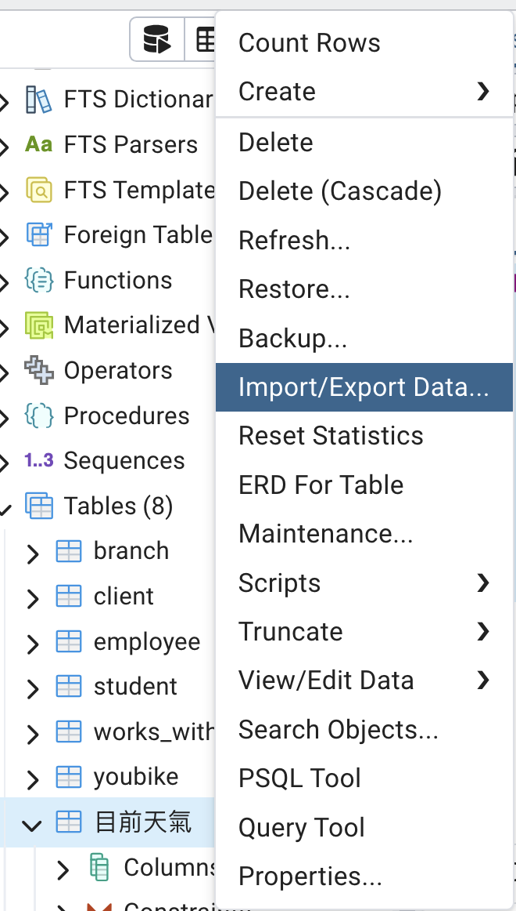
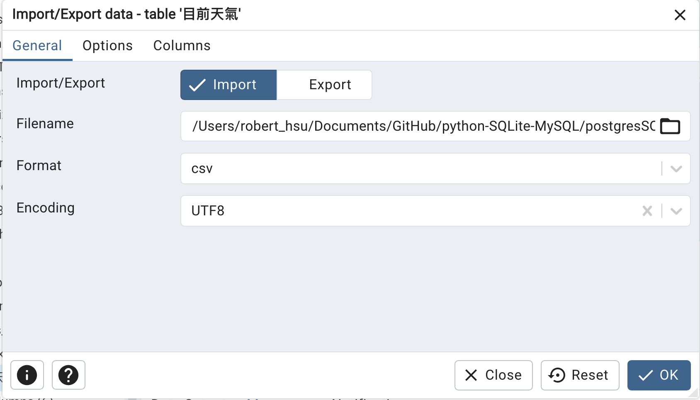
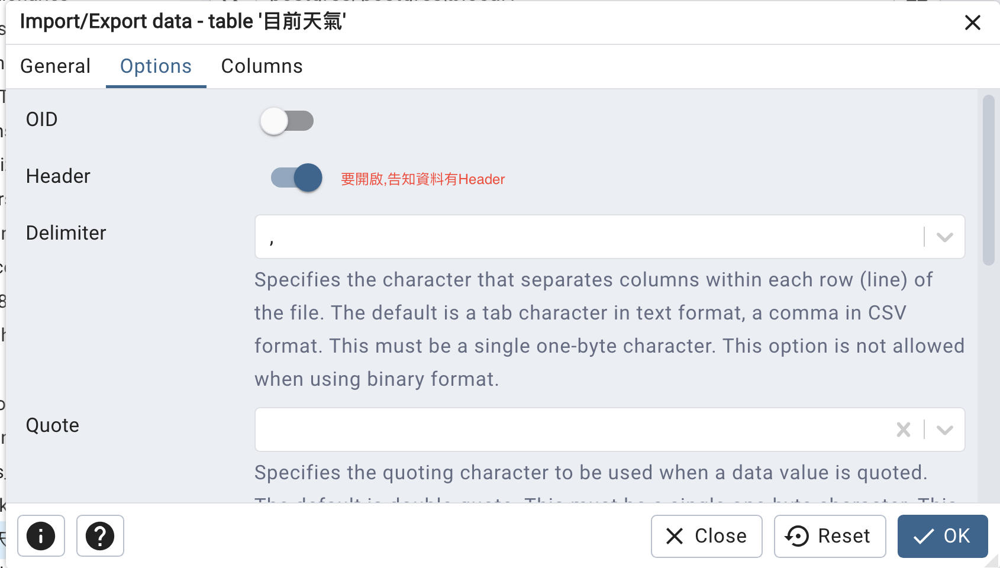

# PostgreSQL 匯入 CSV 檔案教學

## 1. 匯入城市資料 - 使用 SQLite 建立的 city.sql

### 步驟說明
1. 將 `city.csv` 透過 DB Browser for SQLite 匯入
2. 透過 DB Browser for SQLite 匯出 `city.sql`
3. [下載 city.sql 檔案](../範例資料庫/其它範例csv/city.sql)
4. 使用 pgAdmin4 開啟 city.sql，並執行

## 2. 匯入目前天氣資料

### 資料來源
- [下載目前天氣.csv](../範例資料庫/其它範例csv/目前天氣.csv)

### 建立資料表
```sql
/* 建立目前天氣資料表 */
CREATE TABLE IF NOT EXISTS 目前天氣(
    城市 VARCHAR(10),
    啟始時間 TIMESTAMPTZ,  /* 資料含時間與時區,例如 2023-07-22T12:00:00+08:00 */
    結束時間 TIMESTAMPTZ,
    最高溫度 REAL,
    最低溫度 REAL,
    感覺 VARCHAR,
    PRIMARY KEY(城市)
);
```

### 匯入步驟
使用 pgAdmin 匯入 `目前天氣.csv` 至資料表 `目前天氣`





## 3. 匯入台鐵車站資訊和車站進出資料

### 資料來源
- [台鐵車站資訊.csv](../範例資料庫/其它範例csv/台鐵車站資訊.csv)
- [2019-2023進出資訊](../範例資料庫/其它範例csv/每日各站進出站人數20190423-20231231.zip)

### 建立關聯式資料表

> 💡 欄位名稱沒有加雙引號時，PostgreSQL 會自動轉成小寫，例如 `stationCode` 實際上是 `stationcode`。

#### 先刪除舊的資料表（如果需要重新建立）

```sql
-- 有 foreign key 時,要先刪除 child table,再刪除 parent table
DROP TABLE IF EXISTS station_in_out;
DROP TABLE IF EXISTS stations;
```

#### 車站資料表
```sql
CREATE TABLE IF NOT EXISTS stations(
    id SERIAL PRIMARY KEY,
    stationCode VARCHAR(5) UNIQUE NOT NULL,  /* 必須設定，因為是 foreign key 的 parent */
    stationName VARCHAR(20) NOT NULL,
    name VARCHAR(20),
    stationAddrTw VARCHAR(50),
    stationTel VARCHAR(20),
    gps VARCHAR(30),
    haveBike BOOLEAN   /* CSV 中的 Y/N 會自動轉成 true/false */
);

-- 查詢資料
SELECT * FROM stations;
```

> 匯入 `台鐵車站資訊.csv` 時，因為資料表多了 `id` 欄位，請在 pgAdmin 匯入畫面的 **Columns** 取消勾選 `id`。

#### 車站進出資料表
```sql
CREATE TABLE IF NOT EXISTS station_in_out(
    date TIMESTAMP,
    staCode VARCHAR(5) NOT NULL,
    gateInComingCnt INTEGER,
    gateOutGoingCnt INTEGER,
    PRIMARY KEY (date, staCode),
    FOREIGN KEY (staCode)  /* 可設可不設，有設可以保持資料的完整性 */
        REFERENCES stations(stationCode)
        ON DELETE CASCADE
        ON UPDATE CASCADE
);
```

### 查詢範例

#### JOIN 查詢
```sql
SELECT * 
FROM station_in_out in_out 
JOIN stations s ON in_out.staCode = s.stationCode;
```

#### 時間查詢語法
```sql
-- 查詢特定日期
SELECT * FROM table_name WHERE date_column = 'YYYY-MM-DD';

-- 查詢時間範圍
SELECT * FROM table_name 
WHERE timestamp_column BETWEEN 'start_timestamp' AND 'end_timestamp';

-- 查詢最近7天
SELECT * FROM table_name 
WHERE timestamp_column >= NOW() - INTERVAL '7 days';

-- 查詢未來7天
SELECT * FROM tasks 
WHERE task_due_date BETWEEN NOW() AND NOW() + INTERVAL '7 days';
```

#### 布林值查詢
```sql
SELECT * FROM table_name WHERE boolean_column = TRUE;
```

## 4. 匯入繁體中文範例資料庫

網路商店、學校選課、圖書館借閱三個練習用資料庫，各只有一個 `.sql` 檔，在 pgAdmin 的 Query Tool 開啟後執行即可匯入。

👉 [繁體中文範例資料庫](../範例資料庫/中文範例資料庫/)
