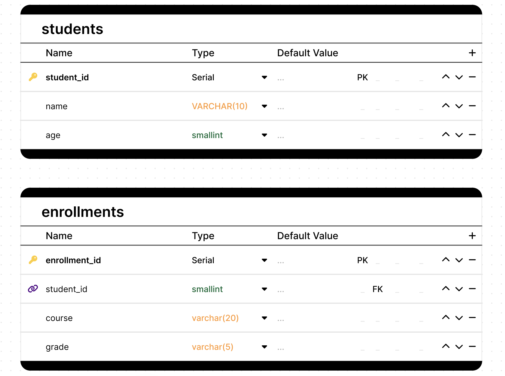
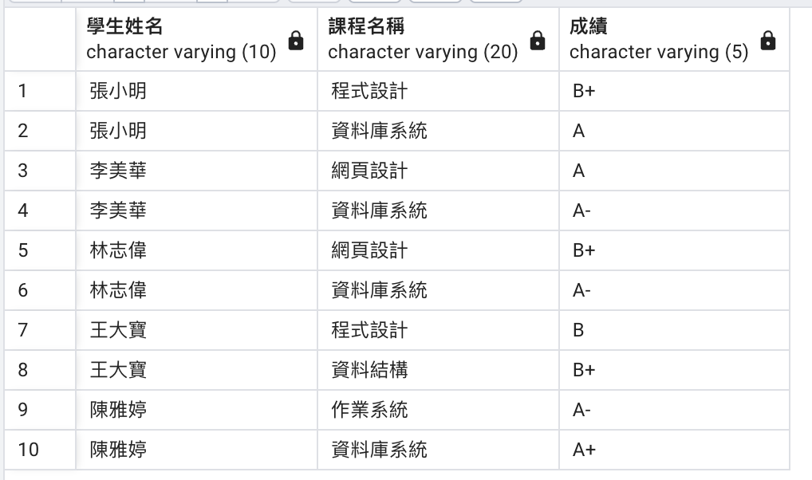

## 適合初學者關聯資料庫
- 學生students
- 註冊上課的科目enrollments

> ⚠️ [中文範例資料庫](../範例資料庫/中文範例資料庫/)的 `school.sql` 也有 `students`、`enrollments` 資料表，請建立在**不同的資料庫**，避免互相覆蓋。



### 建立資料表

```sql
-- Create Tables
CREATE TABLE students (
    student_id SERIAL PRIMARY KEY,
    name VARCHAR(10),
    age smallint
);

CREATE TABLE enrollments (
    enrollment_id SERIAL PRIMARY KEY,
    student_id smallint REFERENCES students(student_id),
    course_name VARCHAR(20),
    grade VARCHAR(5)
);

```

### 資料表加入資料

```sql
-- Insert data into students table
INSERT INTO students (name, age) VALUES
    ('張小明', 20),
    ('李美華', 19),
    ('王大寶', 21),
    ('陳雅婷', 20),
    ('林志偉', 22);

-- Insert data into enrollments table
INSERT INTO enrollments (student_id, course_name, grade) VALUES
    (1, '資料庫系統', 'A'),
    (1, '程式設計', 'B+'),
    (2, '資料庫系統', 'A-'),
    (2, '網頁設計', 'A'),
    (3, '程式設計', 'B'),
    (3, '資料結構', 'B+'),
    (4, '資料庫系統', 'A+'),
    (4, '作業系統', 'A-'),
    (5, '網頁設計', 'B+'),
    (5, '資料庫系統', 'A-');
```

### 使用join顯示所有資料

```sql
SELECT 
    s.name AS 學生姓名,
    e.course_name AS 課程名稱,
    e.grade AS 成績
FROM students s
JOIN enrollments e ON s.student_id = e.student_id
ORDER BY s.name, e.course_name;
```

#### 結果



---

## 🤖 不寫 SQL，用 Prompt 完成

> 在 Claude Desktop 使用[第 3 章](../MCP操作資料庫/2_用中文查詢資料庫/#6-準備第-4-章設定可寫入的連線)設定的 **`postgres-sql`**（可寫入，連到 `sql_tutorial` 資料庫）。
> 每個 prompt 執行後，點開工具呼叫（`execute_sql`），**對照 AI 執行的 SQL 和上面學的是否一樣**。

**Prompt 1：建立資料表**

> 用 postgres-sql 建立兩張資料表：
> - students：student_id 是 SERIAL 主鍵，name 是 VARCHAR(10)，age 是 SMALLINT
> - enrollments：enrollment_id 是 SERIAL 主鍵，student_id 參考 students，course_name 是 VARCHAR(20)，grade 是 VARCHAR(5)

**Prompt 2：新增資料**

> 新增學生：張小明 20 歲、李美華 19 歲、王大寶 21 歲、陳雅婷 20 歲、林志偉 22 歲。
> 新增選課（學生、課程、成績）：張小明 資料庫系統 A、張小明 程式設計 B+、李美華 資料庫系統 A-、李美華 網頁設計 A、王大寶 程式設計 B、王大寶 資料結構 B+、陳雅婷 資料庫系統 A+、陳雅婷 作業系統 A-、林志偉 網頁設計 B+、林志偉 資料庫系統 A-。

✅ 注意 AI 新增選課時，student_id 是**查詢出來的**，還是自己猜 1、2、3？如果學生資料表原本就有資料，猜的編號會對錯人。

**Prompt 3：查詢**

> 列出每位學生修的課程名稱和成績，依學生姓名、課程名稱排序。

✅ 共 10 筆，對照上面的「使用join顯示所有資料」結果圖。

**延伸：**

> 每門課有幾位學生修？哪門課最多人修？

✅ 資料庫系統 4 人最多。
