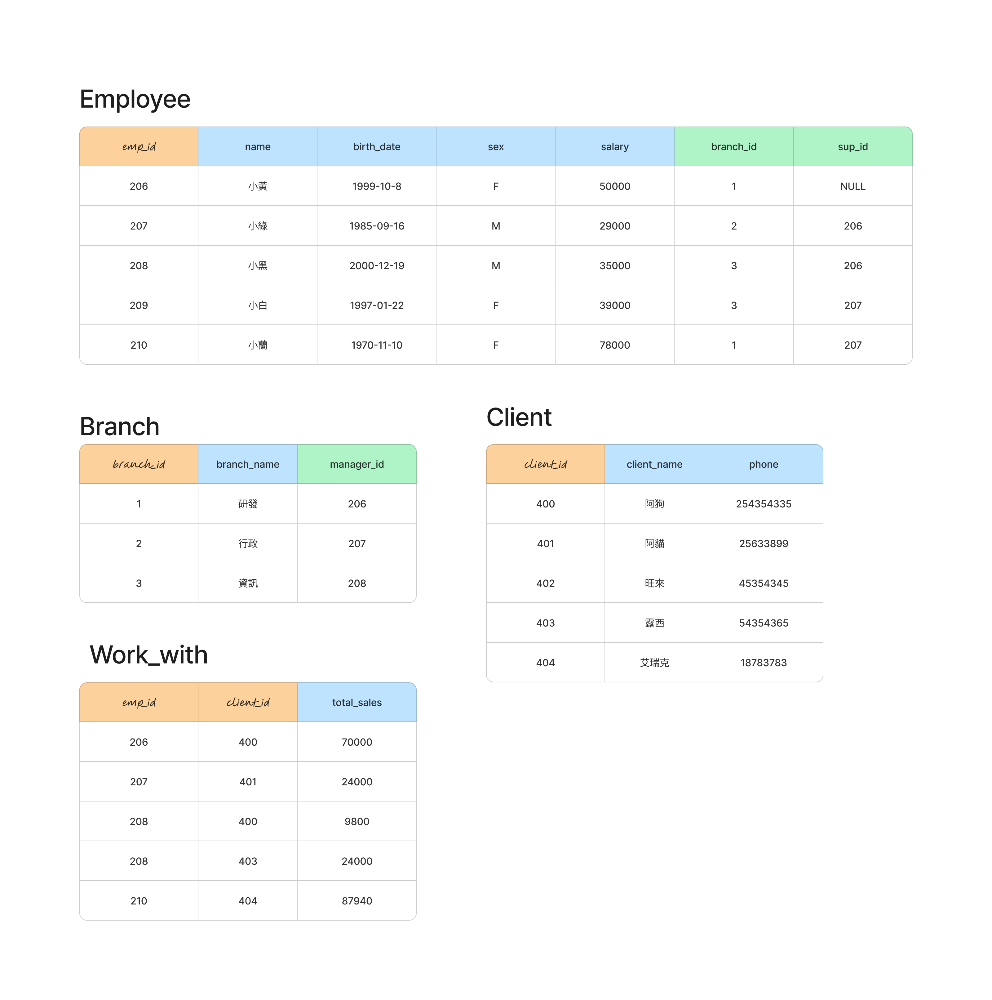

## 建立關聯資料庫

### 語法

```sql
FOREIGN KEY(fk_columns) 
REFERENCES parent_table(parent_key_columns)
[ON DELETE delete_action]
[ON UPDATE update_action]
```

### action 支援語法

- SET NULL
- SET DEFAULT
- RESTRICT
- NO ACTION
- CASCADE



> 圖中部分資料和 [8新增關聯資料庫資料.sql](./8新增關聯資料庫資料.sql) 不同，**以 SQL 為準**：小黃生日是 1998-10-08、小藍薪水是 84000、員工 208 的第一位客戶是 402（旺來）。

### 創建公司資料庫

```sql
DROP TABLE IF EXISTS employee CASCADE;
DROP TABLE IF EXISTS  branch CASCADE;
DROP TABLE IF EXISTS client  CASCADE;
DROP TABLE IF EXISTS works_with CASCADE;
```

#### 創立員工表格

```sql
CREATE TABLE employee(
	emp_id SERIAL,
	name VARCHAR(20),
	birth_date DATE,
	sex VARCHAR(1),
	salary INT,
	branch_id INT,
	sup_id INT,
 	PRIMARY KEY(emp_id)
);
```

> [參考語法foreign key](https://neon.com/postgresql/tutorial/foreign-key)

#### 創立部門表格

```sql
CREATE TABLE branch(
	branch_id INT,
	branch_name VARCHAR(20),
	manager_id INT,
	PRIMARY KEY(branch_id),
	FOREIGN KEY(manager_id)
	REFERENCES employee(emp_id) ON DELETE SET NULL
);
```

#### 補上employee少設的2個Foreign key

> 建立 employee 時 branch 資料表還不存在，所以 `branch_id` 的 foreign key 要等 branch 建立後再補上。

```sql
ALTER TABLE employee
ADD FOREIGN KEY(branch_id) REFERENCES branch(branch_id) ON DELETE SET NULL;

ALTER TABLE employee
ADD FOREIGN KEY(sup_id)
REFERENCES employee(emp_id)
ON DELETE SET NULL;
```

#### 創建客戶表格

```sql
CREATE TABLE client(
	client_id SERIAL,
	client_name VARCHAR(20),
	phone VARCHAR(20),
	PRIMARY KEY(client_id)
);
```


#### 創建works_with表格

```sql
CREATE TABLE works_with(
	emp_id INT,
	client_id INT,
	total_sales INT,
	PRIMARY KEY(emp_id,client_id),
	FOREIGN KEY(emp_id) REFERENCES employee(emp_id) ON DELETE CASCADE,
	FOREIGN KEY(client_id) REFERENCES client(client_id) ON DELETE CASCADE
);
```


---

## 🤖 不寫 SQL，用 Prompt 完成

> 在 Claude Desktop 使用[第 3 章](../MCP操作資料庫/2_用中文查詢資料庫/#6-準備第-4-章設定可寫入的連線)設定的 **`postgres-sql`**（可寫入，連到 `sql_tutorial` 資料庫）。
> 每個 prompt 執行後，點開工具呼叫（`execute_sql`），**對照 AI 執行的 SQL 和上面學的是否一樣**。

**Prompt 1：建立公司資料庫**

> 用 postgres-sql 建立公司資料庫的 4 張資料表（如果存在先刪除）：
> - employee：emp_id SERIAL 主鍵、name VARCHAR(20)、birth_date DATE、sex VARCHAR(1)、salary INT、branch_id INT、sup_id INT
> - branch：branch_id INT 主鍵、branch_name VARCHAR(20)、manager_id INT 參考 employee，員工被刪除時設為 NULL
> - employee 的 branch_id 參考 branch、sup_id 參考 employee 自己，被刪除時都設為 NULL
> - client：client_id SERIAL 主鍵、client_name VARCHAR(20)、phone VARCHAR(20)
> - works_with：emp_id、client_id 為組合主鍵，total_sales INT；emp_id、client_id 都是 foreign key，被刪除時一起刪除
>
> 建立之前先把 SQL 給我看。

✅ 檢查重點：
- employee 和 branch **互相參考**，AI 要先建立 employee（不含 branch_id 的 foreign key），建立 branch 後再用 `ALTER TABLE` 補上，和上面的做法一樣
- 每個 foreign key 的 `ON DELETE` 是否和要求的一樣

**Prompt 2：畫出關聯**

> 畫出這 4 張資料表的關聯圖，並說明每個 foreign key 的用途。

👉 接下來的新增、查詢、聯集、連結、子查詢，請看 [關聯資料庫實作：用 Prompt 操作](./關聯資料庫實作_用Prompt操作.md)
