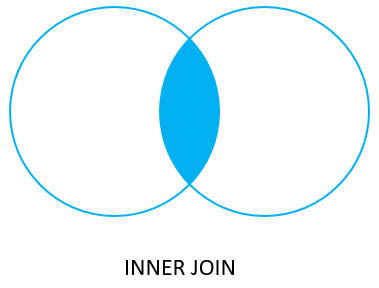
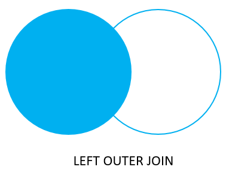
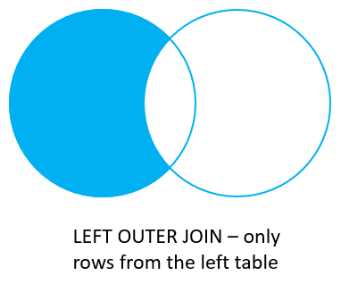
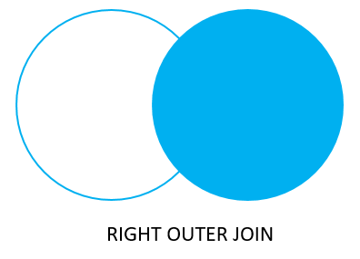
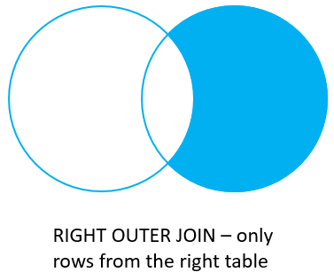
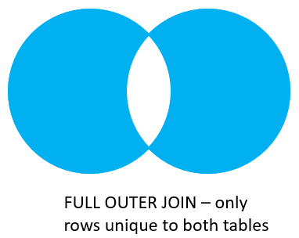

## JOIN(連結)

## 新增2個資料表,並加入資料

```sql
CREATE TABLE basket_a(
	a INT PRIMARY KEY,
	fruit_a VARCHAR(100) NOT NULL
);

CREATE TABLE basket_b(
	b INT PRIMARY KEY,
	fruit_b VARCHAR(100) NOT NULL
);

INSERT INTO basket_a (a, fruit_a)
VALUES
    (1, 'Apple'),
    (2, 'Orange'),
    (3, 'Banana'),
    (4, 'Cucumber');
	
INSERT INTO basket_b (b, fruit_b)
VALUES
    (1, 'Orange'),
    (2, 'Apple'),
    (3, 'Watermelon'),
    (4, 'Pear');
```

### 結果
```
a | fruit_a
---+----------
 1 | Apple
 2 | Orange
 3 | Banana
 4 | Cucumber
(4 rows)


b |  fruit_b
---+------------
 1 | Orange
 2 | Apple
 3 | Watermelon
 4 | Pear
(4 rows)
```

### inner join(交集)

```sql
/*INNER JOIN-交集*/
SELECT a,fruit_a,b,fruit_b
FROM basket_a INNER JOIN basket_b ON fruit_a = fruit_b
```



### 結果:

```
a | fruit_a | b | fruit_b
---+---------+---+---------
 1 | Apple   | 2 | Apple
 2 | Orange  | 1 | Orange
```

---

### left join

```sql
/*LEFT JOIN*/
SELECT a, fruit_a, b, fruit_b
FROM basket_a LEFT JOIN basket_b ON fruit_a = fruit_b
```



### 結果

```
 a | fruit_a  |  b   | fruit_b
---+----------+------+---------
 1 | Apple    |    2 | Apple
 2 | Orange   |    1 | Orange
 3 | Banana   | null | null
 4 | Cucumber | null | null
```

---

### left join(加上where 語法)

```sql
SELECT a, fruit_a, b, fruit_b
FROM basket_a LEFT JOIN basket_b ON fruit_a = fruit_b
WHERE b IS NULL
```



### 結果

```
a | fruit_a  |  b   | fruit_b
---+----------+------+---------
 3 | Banana   | null | null
 4 | Cucumber | null | null
```

---

### right join

```sql
SELECT a, fruit_a, b, fruit_b
FROM basket_a RIGHT JOIN basket_b ON fruit_a = fruit_b
```



### 結果

```
a   | fruit_a | b |  fruit_b
------+---------+---+------------
    2 | Orange  | 1 | Orange
    1 | Apple   | 2 | Apple
 null | null    | 3 | Watermelon
 null | null    | 4 | Pear
```

---

### right join(where)

```sql
/*RIGHT JOIN with WHERE Clause*/
SELECT a, fruit_a, b, fruit_b
FROM basket_a RIGHT JOIN basket_b ON fruit_a = fruit_b
WHERE a IS NULL
```



### 結果

```
 a   | fruit_a | b |  fruit_b
------+---------+---+------------
 null | null    | 3 | Watermelon
 null | null    | 4 | Pear
(2 rows)
```

---

### full outer join

```sql
SELECT a, fruit_a, b, fruit_b
FROM basket_a FULL OUTER JOIN basket_b ON fruit_a = fruit_b
```


### 結果

```
a   | fruit_a  |  b   |  fruit_b
------+----------+------+------------
    1 | Apple    |    2 | Apple
    2 | Orange   |    1 | Orange
    3 | Banana   | null | null
    4 | Cucumber | null | null
 null | null     |    3 | Watermelon
 null | null     |    4 | Pear
```

---

### full outer join with where

```sql
SELECT a, fruit_a, b, fruit_b
FROM basket_a FULL OUTER JOIN basket_b ON fruit_a = fruit_b
WHERE a IS NULL OR b IS NULL;
```



### 結果

```
 a   | fruit_a  |  b   |  fruit_b
------+----------+------+------------
    3 | Banana   | null | null
    4 | Cucumber | null | null
 null | null     |    3 | Watermelon
 null | null     |    4 | Pear
```


---

## 🤖 不寫 SQL，用 Prompt 完成

> 在 Claude Desktop 使用[第 3 章](../MCP操作資料庫/2_用中文查詢資料庫/#6-準備第-4-章設定可寫入的連線)設定的 **`postgres-sql`**（可寫入，連到 `sql_tutorial` 資料庫）。
> 每個 prompt 執行後，點開工具呼叫（`execute_sql`），**對照 AI 執行的 SQL 和上面學的是否一樣**。

**先準備資料：**

> 用 postgres-sql 建立 basket_a（a 整數主鍵、fruit_a VARCHAR(100) 必填）和 basket_b（b 整數主鍵、fruit_b VARCHAR(100) 必填），如果存在先刪除。
> basket_a 放入：1 Apple、2 Orange、3 Banana、4 Cucumber。basket_b 放入：1 Orange、2 Apple、3 Watermelon、4 Pear。

| # | Prompt | 對照上面 | 答案 |
|:---:|---|---|---|
| 1 | 列出兩個籃子都有的水果 | inner join | Apple、Orange |
| 2 | 列出 A 籃所有水果，以及 B 籃有沒有一樣的 | left join | 4 筆，Banana、Cucumber 的 B 籃欄位是 NULL |
| 3 | 只在 A 籃有、B 籃沒有的水果 | left join + where | Banana、Cucumber |
| 4 | 列出 B 籃所有水果，以及 A 籃有沒有一樣的 | right join | 4 筆 |
| 5 | 只在 B 籃有、A 籃沒有的水果 | right join + where | Watermelon、Pear |
| 6 | 兩個籃子所有水果都列出來對照 | full outer join | 6 筆 |
| 7 | 只出現在其中一個籃子的水果 | full outer join + where | Banana、Cucumber、Watermelon、Pear |

✅ 檢查重點：
- 每一題 AI 用的是哪一種 JOIN？和上面的圖對照
- 第 3 題 AI 可能用 `NOT EXISTS` 或 `NOT IN` 而不是 LEFT JOIN，**結果一樣也是對的**。問 AI：「可以改用 LEFT JOIN 寫嗎？」
