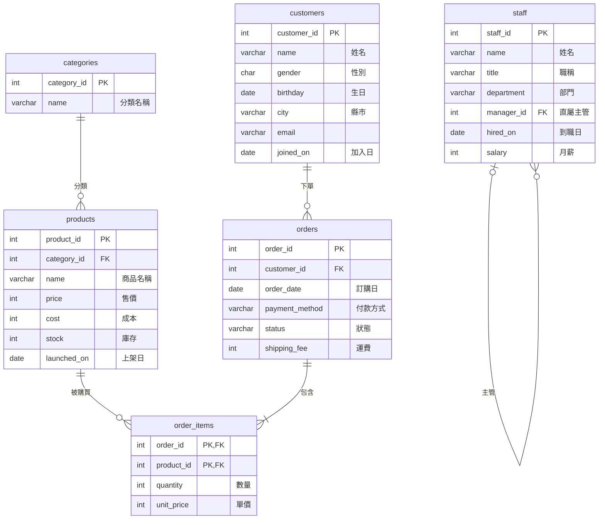
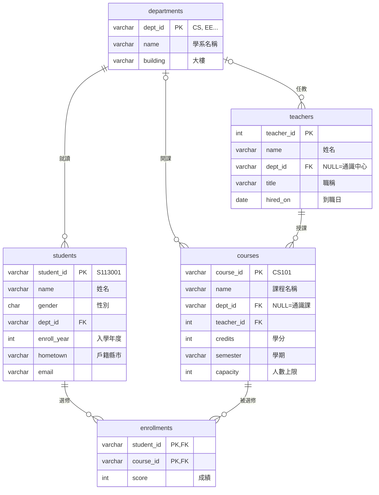
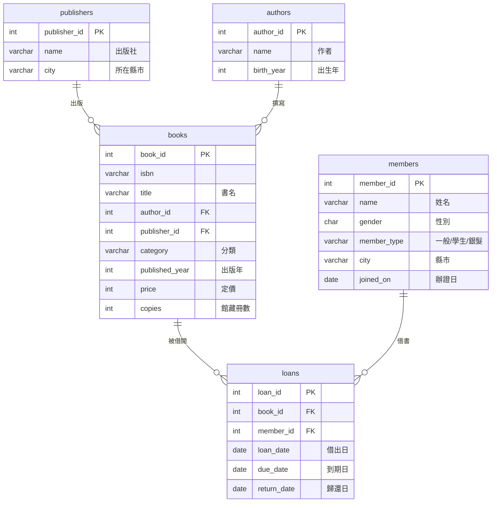

# 繁體中文範例資料庫

三個小型的關聯式資料庫，內容全部是繁體中文。**每個資料庫只有一個 `.sql` 檔，執行一次就能建好資料表並匯入資料。**

| 資料庫 | 檔案 | 大小 | 資料表 | 資料量 | 適合練習 |
|---|---|---|---|---|---|
| 🛒 網路商店 | [shop.sql](./shop.sql) | 87 KB | 6 | 700 筆訂單、1,400+ 筆明細 | SELECT、WHERE、JOIN、GROUP BY、日期函式、自我連結 |
| 🎓 學校選課 | [school.sql](./school.sql) | 48 KB | 5 | 200 位學生、1,000+ 筆選課 | 多對多 JOIN、LEFT JOIN、HAVING、子查詢、CASE WHEN |
| 📚 圖書館借閱 | [library.sql](./library.sql) | 64 KB | 5 | 50 本書、900 筆借閱 | 日期計算、IS NULL、LEFT JOIN、視窗函式 RANK |

> - 資料表和欄位名稱使用**英文**（打 SQL 不用切換輸入法），資料內容是**繁體中文**。每張資料表都有中文註解（COMMENT），在 pgAdmin / DBeaver 裡看得到。
> - 三個檔案的資料表名稱不重複，可以**全部匯入同一個資料庫**。
> - 檔案可以**重複執行**：會先刪除同名資料表再重建，學生把資料改壞了，重新執行一次就恢復原狀。
> - 人名、書名、出版社都是虛構的，email 使用 `example.com`。

---

## 目錄

- [匯入方式](#匯入方式)
- [🛒 網路商店 shop](#-網路商店-shop)
- [🎓 學校選課 school](#-學校選課-school)
- [📚 圖書館借閱 library](#-圖書館借閱-library)
- [重新產生資料](#重新產生資料)

---

## 匯入方式

先建立一個資料庫（以下用 `practice` 為例）：

```sql
CREATE DATABASE practice;
```

接著挑一種方式執行 `.sql` 檔：

### 方法一：pgAdmin（最簡單）

1. 在左側點選 `practice` 資料庫 → 上方選單 **Tools → Query Tool**
2. 點 📂 **Open File**，選擇 `shop.sql`
3. 按 ▶ **Execute**（F5）

### 方法二：DBeaver

1. 在 `practice` 資料庫上按右鍵 → **SQL 編輯器 → 開啟 SQL 腳本**
2. 把 `shop.sql` 的內容貼上（或用 **檔案 → 開啟檔案**）
3. 按 **執行 SQL 腳本**（`Alt + X`），注意不是只執行一行的 `Ctrl + Enter`

### 方法三：psql 命令列

```bash
psql -U postgres -d practice -f shop.sql
```

### 方法四：PostgreSQL 跑在 Docker 裡

```bash
# macOS / Linux / Windows cmd
docker exec -i my-postgres psql -U postgres -d practice < shop.sql

# Windows PowerShell
Get-Content shop.sql -Encoding UTF8 | docker exec -i my-postgres psql -U postgres -d practice
```

### 確認匯入成功

```sql
SELECT relname AS 資料表, n_live_tup AS 筆數
FROM pg_stat_user_tables
ORDER BY relname;
```

---

## 🛒 網路商店 shop

一間網路商店 2025 年整年的訂單資料。



**設計好的教學情境**

- 11、12 月（雙 11、年底）訂單較多 → 練習依月份分組
- 有 18 位會員從沒下過單 → 練習 `LEFT JOIN ... IS NULL`
- 「智慧手環」是新品，沒有人買過；有 6 項商品缺貨（`stock = 0`）
- 部分會員沒填生日（`NULL`）、工讀生沒有月薪（`NULL`）
- `staff.manager_id` 指向同一張表 → 練習自我連結（self join）

### 練習題

1. 列出所有「3C周邊」的商品，依價格由高到低排序
2. 2025 年每個月有幾筆訂單？
3. 找出從來沒有下過訂單的會員
4. 各分類的營業額（只算「已完成」訂單），由高到低排序
5. 下單次數 10 次以上的會員
6. 列出每位員工和他的直屬主管姓名
7. 找出售價高於全部商品平均售價的商品

<details>
<summary>參考答案</summary>

```sql
-- 1
SELECT p.name, p.price
FROM products p
JOIN categories c ON p.category_id = c.category_id
WHERE c.name = '3C周邊'
ORDER BY p.price DESC;

-- 2
SELECT EXTRACT(MONTH FROM order_date) AS 月份, COUNT(*) AS 訂單數
FROM orders
GROUP BY 月份
ORDER BY 月份;

-- 3
SELECT c.name, c.city
FROM customers c
LEFT JOIN orders o ON c.customer_id = o.customer_id
WHERE o.order_id IS NULL;

-- 4
SELECT c.name AS 分類, SUM(oi.quantity * oi.unit_price) AS 營業額
FROM order_items oi
JOIN orders o     ON oi.order_id = o.order_id
JOIN products p   ON oi.product_id = p.product_id
JOIN categories c ON p.category_id = c.category_id
WHERE o.status = '已完成'
GROUP BY c.name
ORDER BY 營業額 DESC;

-- 5
SELECT c.name, COUNT(*) AS 訂單數
FROM orders o
JOIN customers c ON o.customer_id = c.customer_id
GROUP BY c.customer_id, c.name
HAVING COUNT(*) >= 10
ORDER BY 訂單數 DESC;

-- 6
SELECT e.name AS 員工, e.title AS 職稱, m.name AS 主管
FROM staff e
LEFT JOIN staff m ON e.manager_id = m.staff_id;

-- 7
SELECT name, price
FROM products
WHERE price > (SELECT AVG(price) FROM products)
ORDER BY price DESC;
```

</details>

---

## 🎓 學校選課 school

一所大學 6 個學系、3 個學期（113-1、113-2、114-1）的選課與成績。



**設計好的教學情境**

- `enrollments` 是學生和課程的**多對多**中介表
- 114-1 學期還沒結束，成績是 `NULL` → 練習 `IS NULL`、`AVG` 會忽略 NULL
- 通識課與通識中心老師的 `dept_id` 是 `NULL` → `JOIN` 和 `LEFT JOIN` 結果不同
- 「量子計算入門」沒有人選、有幾位老師這學年沒開課 → 練習找出「沒有對應資料」的列
- 體育 0 學分

### 練習題

1. 每個學系各有幾位學生？
2. 列出每門課的修課人數（包含沒有人選的課）
3. 平均成績低於 72 分的課程，以及不及格人數
4. 找出這學年沒有開課的老師
5. 把「程式設計(一)」（CS101）的成績轉換成 A/B/C/D/F 等第
6. 每位學生已經拿到的學分數（60 分以上才算），取前 10 名

<details>
<summary>參考答案</summary>

```sql
-- 1
SELECT d.name AS 學系, COUNT(s.student_id) AS 人數
FROM departments d
LEFT JOIN students s ON d.dept_id = s.dept_id
GROUP BY d.name
ORDER BY 人數 DESC;

-- 2
SELECT c.course_id, c.name, COUNT(e.student_id) AS 修課人數, c.capacity AS 上限
FROM courses c
LEFT JOIN enrollments e ON c.course_id = e.course_id
GROUP BY c.course_id, c.name, c.capacity
ORDER BY 修課人數;

-- 3
SELECT c.name,
       ROUND(AVG(e.score), 1)              AS 平均,
       COUNT(*) FILTER (WHERE e.score < 60) AS 不及格人數
FROM enrollments e
JOIN courses c ON e.course_id = c.course_id
WHERE e.score IS NOT NULL
GROUP BY c.name
HAVING AVG(e.score) < 72
ORDER BY 平均;

-- 4
SELECT name, title
FROM teachers
WHERE teacher_id NOT IN (SELECT teacher_id FROM courses);

-- 5
SELECT s.name, e.score,
       CASE
           WHEN e.score >= 90 THEN 'A'
           WHEN e.score >= 80 THEN 'B'
           WHEN e.score >= 70 THEN 'C'
           WHEN e.score >= 60 THEN 'D'
           ELSE 'F'
       END AS 等第
FROM enrollments e
JOIN students s ON e.student_id = s.student_id
WHERE e.course_id = 'CS101'
ORDER BY e.score DESC;

-- 6
SELECT s.student_id, s.name, SUM(c.credits) AS 已修學分
FROM students s
JOIN enrollments e ON s.student_id = e.student_id
JOIN courses c     ON e.course_id = c.course_id
WHERE e.score >= 60
GROUP BY s.student_id, s.name
ORDER BY 已修學分 DESC
LIMIT 10;
```

</details>

---

## 📚 圖書館借閱 library

一間社區圖書館從 2025-01 到 2026-09 的借還書紀錄。



**設計好的教學情境**

- `return_date` 是 `NULL` 代表還沒還書
- 借期依會員類型不同：一般 14 天、學生 21 天、銀髮 28 天
- 有逾期才歸還的紀錄、也有逾期很久還沒還的 → 練習日期相減
- 有 2 本書從沒被借過、有 2 位作者在館內沒有書

### 練習題

1. 目前逾期未還的書，列出借閱人、書名、逾期天數
2. 從來沒有被借過的書
3. 各分類的借閱次數排行
4. 最熱門的前 5 本書（用 `RANK()` 排名，同票同名次）
5. 逾期歸還、尚未歸還的紀錄各有幾筆
6. 每位會員平均每次借幾天才還？（只算已歸還）

<details>
<summary>參考答案</summary>

```sql
-- 1(逾期天數會隨著今天的日期改變)
SELECT m.name, b.title, l.due_date,
       CURRENT_DATE - l.due_date AS 逾期天數
FROM loans l
JOIN members m ON l.member_id = m.member_id
JOIN books b   ON l.book_id = b.book_id
WHERE l.return_date IS NULL
  AND l.due_date < CURRENT_DATE
ORDER BY 逾期天數 DESC;

-- 2
SELECT b.title
FROM books b
LEFT JOIN loans l ON b.book_id = l.book_id
WHERE l.loan_id IS NULL;

-- 3
SELECT b.category AS 分類, COUNT(*) AS 借閱次數
FROM loans l
JOIN books b ON l.book_id = b.book_id
GROUP BY b.category
ORDER BY 借閱次數 DESC;

-- 4
SELECT *
FROM (
    SELECT b.title, COUNT(*) AS 借閱次數,
           RANK() OVER (ORDER BY COUNT(*) DESC) AS 名次
    FROM loans l
    JOIN books b ON l.book_id = b.book_id
    GROUP BY b.title
) t
WHERE 名次 <= 5;

-- 5
SELECT COUNT(*) FILTER (WHERE return_date > due_date) AS 逾期歸還,
       COUNT(*) FILTER (WHERE return_date IS NULL)    AS 尚未歸還
FROM loans;

-- 6
SELECT m.name, m.member_type,
       ROUND(AVG(l.return_date - l.loan_date), 1) AS 平均借閱天數
FROM loans l
JOIN members m ON l.member_id = m.member_id
WHERE l.return_date IS NOT NULL
GROUP BY m.member_id, m.name, m.member_type
ORDER BY 平均借閱天數 DESC;
```

</details>

---

## 重新產生資料

三個 `.sql` 檔是由 [generate.py](./generate.py) 產生的（只用到 Python 標準函式庫）。程式使用固定的亂數種子，每次產生的結果都一樣。想調整資料量或內容，修改後重新執行：

```bash
python3 generate.py
```
